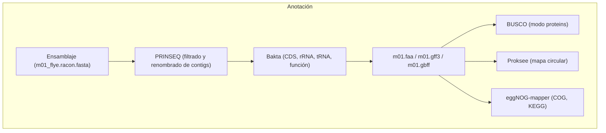
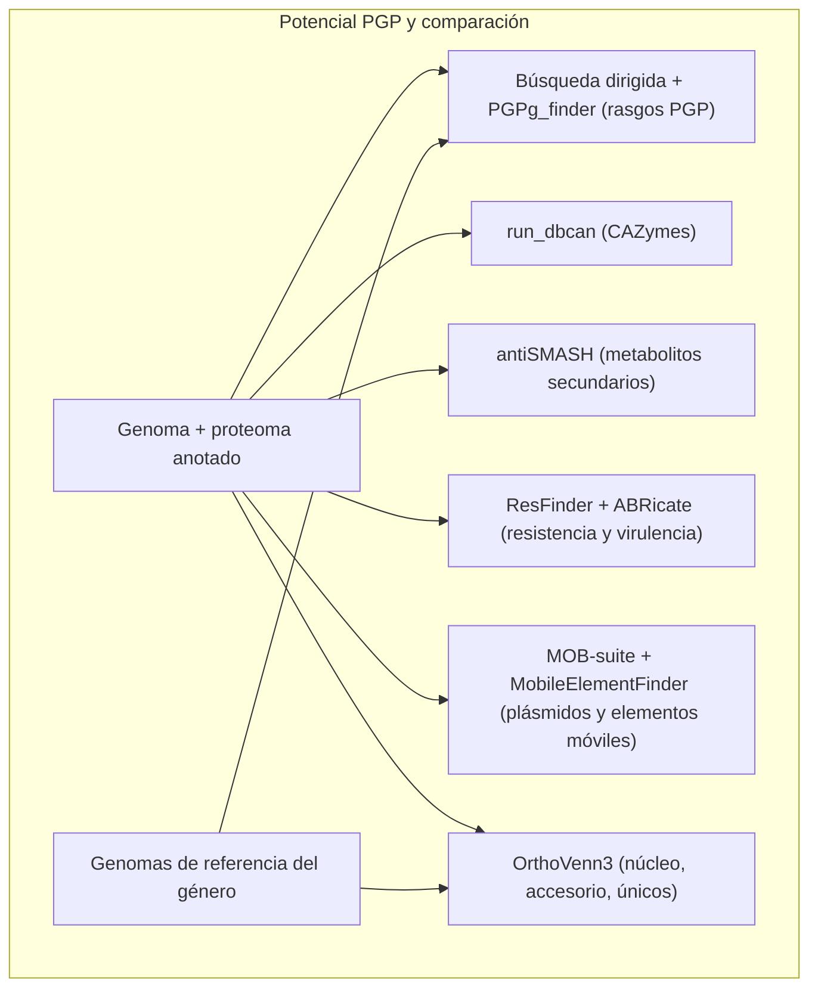

# Semana 06: Anotación de genomas

## Logro de la sesión:

Al finalizar la sesión, el estudiante utiliza herramientas bioinformáticas para anotar estructural y funcionalmente un genoma bacteriano e identificar en él genes asociados a la promoción del crecimiento vegetal.

## Estructura de la práctica:

1. Acceso al servidor de cómputo
2. Preparación del genoma y anotación con Bakta
3. Envío de los análisis en línea (eggNOG-mapper y antiSMASH)
4. Evaluación del proteoma con BUSCO
5. Visualización del genoma anotado
6. Anotación funcional con eggNOG-mapper (COG y KEGG)
7. Identificación de genes promotores del crecimiento vegetal (PGP)
8. Identificación de enzimas activas sobre carbohidratos (CAZymes)
9. Identificación de clústeres de metabolitos secundarios (antiSMASH)
10. Evaluación de bioseguridad: genes de resistencia y de virulencia (ResFinder y ABRicate)
11. Identificación de plásmidos y elementos genéticos móviles (MOB-suite y MobileElementFinder)
12. Genómica comparativa con OrthoVenn3
13. Anotación del genoma ensamblado y validado en la semana 05

> **Cómo está organizada esta práctica:** las secciones 2 a 12 son **demostrativas** y se realizan con un genoma de ejemplo, `m01` (`/data/2025_1/database/m01_flye.racon.fasta`), una cepa del género *Vibrio* cuyo genoma tiene dos cromosomas y plásmidos. Al final (sección 13), cada grupo repite todo el proceso con **el genoma que ensambló y validó en la semana 05**, que corresponde a una bacteria promotora del crecimiento vegetal, y con esos resultados elabora la bitácora.
>
> El genoma de demostración **no** es una bacteria promotora del crecimiento vegetal: sirve para aprender a ejecutar cada programa y a leer sus salidas. Los resultados de las secciones 7 a 11 serán distintos con su cepa, y ese contraste es parte de la discusión.

## Flujo de trabajo:

### Preparación y anotación (secciones 2 a 6):



### Análisis dirigidos y comparativos (secciones 7 a 12):



## Programas requeridos:

### Programas de acceso al servidor:

PuTTY v0.79 https://www.chiark.greenend.org.uk/~sgtatham/putty/latest.html
   - **Descripción:** cliente SSH para establecer conexiones de línea de comandos con el servidor.

WinSCP v6.1 https://winscp.net/eng/download.php
   - **Descripción:** cliente SFTP con interfaz gráfica para transferir archivos entre su computadora y el servidor. En esta práctica se usa con frecuencia: los análisis en línea requieren descargar archivos del servidor y subir los resultados de vuelta.

### Programas bioinformáticos:

PRINSEQ-lite v0.20.4 https://prinseq.sourceforge.net/
   - **Descripción:** PRINSEQ (PReprocessing and INformation of SEQuence data) es un programa para filtrar, formatear y recortar secuencias. En esta práctica se usa para eliminar los contigs muy cortos del ensamblaje y dar a los contigs nombres cortos y uniformes antes de la anotación.

Bakta v1.12.1 https://github.com/oschwengers/bakta
   - **Descripción:** Bakta es un anotador de genomas bacterianos y plásmidos. Realiza la anotación estructural (¿dónde están los genes?) y funcional (¿qué hacen?) en un solo paso: predice CDS (con Pyrodigal, una implementación de Prodigal), rRNA, tRNA, tmRNA, ncRNA, CRISPR y orígenes de replicación, y asigna función a las proteínas mediante identificadores estables (UniRef, RefSeq), lo que hace la anotación reproducible y lista para depositar en bases de datos públicas. Es el sucesor recomendado de Prokka. En el servidor está instalado con su base de datos completa (esquema v6.0), que incluye la de AMRFinderPlus.

BUSCO v6.1.0 https://busco.ezlab.org/
   - **Descripción:** ya usado en la Semana 05 en modo `genome`. Aquí se usa en modo `proteins`, sobre el proteoma anotado, para comprobar que la anotación recuperó los genes que el ensamblaje contenía.

PGPg_finder v1.1.0 https://github.com/tpellegrinetti/PGPg_finder
   - **Descripción:** PGPg_finder identifica genes asociados a rasgos promotores del crecimiento vegetal (PGPT, *Plant Growth-Promoting Traits*). Predice las proteínas con Prodigal (un predictor de genes procariotas) y las compara con DIAMOND contra la base de datos PLaBAse, que organiza los rasgos en una ontología de cinco niveles (por ejemplo, efectos directos → biofertilización → adquisición de nitrógeno → fijación de nitrógeno). Genera tablas de conteo y mapas de calor por nivel.

run_dbcan v5 https://github.com/bcb-unl/run_dbcan
   - **Descripción:** versión local de dbCAN3 para anotar enzimas activas sobre carbohidratos (CAZymes). Combina tres métodos (HMM de familias, HMM de subfamilias y DIAMOND contra CAZy) y, opcionalmente, identifica clústeres de genes de CAZymes (CGC) y predice su sustrato.

ResFinder v4 https://github.com/genomicepidemiology/resfinder
   - **Descripción:** ResFinder identifica genes **adquiridos** de resistencia a antimicrobianos en genomas bacterianos y predice el fenotipo de resistencia asociado. Incluye PointFinder (mutaciones cromosómicas de resistencia, solo para algunas especies de importancia clínica) y DisinFinder (resistencia a desinfectantes y biocidas).

ABRicate v1.0.1 https://github.com/tseemann/abricate
   - **Descripción:** ABRicate busca, por comparación de secuencias (BLAST), genes de resistencia y de virulencia en genomas ensamblados, usando bases de datos como VFDB (factores de virulencia), CARD, ResFinder y NCBI (resistencia) o PlasmidFinder (replicones de plásmidos). En esta práctica se usa con VFDB.

MOB-suite v3.1.9 https://github.com/phac-nml/mob-suite
   - **Descripción:** MOB-suite identifica y caracteriza plásmidos en ensamblajes bacterianos. `mob_recon` separa los contigs en cromosoma y plásmidos, y `mob_typer` clasifica cada plásmido según su replicón, su relaxasa y su capacidad de transferencia (conjugativo, movilizable o no movilizable).

MobileElementFinder v1.1.2 https://pypi.org/project/MobileElementFinder/
   - **Descripción:** MobileElementFinder (`mefinder`) detecta elementos genéticos móviles en genomas ensamblados: secuencias de inserción (IS), transposones (Tn), elementos integrativos y conjugativos (ICE), entre otros.

SeqKit v2 https://bioinf.shenwei.me/seqkit/
   - **Descripción:** herramienta para manipular archivos FASTA/FASTQ; aquí se usa para obtener estadísticas y extraer secuencias de proteínas por su identificador.

### Herramientas bioinformáticas en línea:

eggNOG-mapper https://eggnog-mapper.cgmlab.org/
   - **Descripción:** asigna función a las proteínas por ortología (no por el mejor hit de similitud): ubica cada proteína en un grupo de ortólogos de la base de datos eggNOG y le transfiere la categoría COG, los ortólogos y rutas de KEGG, los términos GO, el número EC y los dominios PFAM.

KEGG Mapper Reconstruct https://www.genome.jp/kegg/mapper/reconstruct.html
   - **Descripción:** a partir de una lista de genes con su KO (KEGG Orthology), reconstruye las rutas metabólicas y módulos presentes en el genoma.

Proksee https://proksee.ca/
   - **Descripción:** genera mapas circulares de genomas bacterianos a partir de un archivo GenBank o FASTA, con pistas de genes, contenido GC y sesgo GC.

antiSMASH (versión bacteriana) https://antismash.secondarymetabolites.org/
   - **Descripción:** identifica clústeres de genes biosintéticos (BGC) de metabolitos secundarios: sideróforos, péptidos no ribosomales (NRPS), policétidos (PKS), bacteriocinas, terpenos, entre otros.

OrthoVenn3 https://orthovenn3.bioinfotoolkits.net/
   - **Descripción:** compara los proteomas de varios genomas, agrupa las proteínas en clústeres de ortólogos y muestra cuántos clústeres son compartidos por todos (núcleo), por algunos (accesorio) o exclusivos de un genoma, con diagramas de Venn/UpSet y enriquecimiento funcional.

PLaBAse (PGPT-Pred) https://plabase.cs.uni-tuebingen.de/
   - **Descripción:** recurso web de bacterias asociadas a plantas del que proviene la ontología PGPT. Su herramienta PGPT-Pred es la alternativa en línea a PGPg_finder.

dbCAN3 https://pro.unl.edu/dbCAN2/
   - **Descripción:** servidor web de dbCAN, alternativa en línea a run_dbcan.

NCBI Datasets Genome https://www.ncbi.nlm.nih.gov/datasets/genome/
   - **Descripción:** ya usado en la Semana 05; aquí se usa para descargar los genomas y proteomas de referencia del género.

## Metodología:

## 1. Acceso al servidor de cómputo:

### Abrir el programa PuTTY, colocar el hostname ( 10.142.250.66 ) y port ( 22 ), y dar clic en Open:


### En la terminal abierta, escribir su usuario y contraseña correspondiente para tener acceso al servidor de cómputo Tensor:


### Abrir el programa WinSCP, colocar el hostname ( 10.142.250.66 ) y port ( 22 ), escribir su usuario y contraseña correspondiente para tener acceso al servidor de cómputo Tensor, y hacer clic en Login:


### Crear la estructura de carpetas de trabajo

```bash
cd ~/genomics

mkdir -p annotation/{bakta,busco,eggnog,pgp,cazymes,antismash,resfinder,virulence,plasmid,mobile,orthovenn}

tree -L 2 ~/genomics/annotation
```

> **Comentario:**
> - `mkdir -p annotation/{...}`: crea la carpeta `annotation` y, dentro de ella, una subcarpeta por cada análisis de la práctica, para que los resultados no se mezclen. La opción `-p` crea las carpetas intermedias y no da error si ya existen.
> - Las carpetas se crean **dentro de `~/genomics`**, junto a `assembly/`, `validation/` y `taxonomy/` de la Semana 05.
> - `tree -L 2`: muestra la estructura creada, hasta dos niveles de profundidad. Debe ver las 11 subcarpetas dentro de `annotation`.

## 2. Preparación del genoma y anotación con Bakta

### Filtrar y renombrar los contigs del ensamblaje

Antes de anotar conviene dejar el ensamblaje "listo para publicar": sin contigs muy cortos y con nombres de contig cortos, uniformes y que identifiquen a la cepa. Esos nombres aparecerán en todas las tablas de la práctica y en los archivos que se depositan en las bases de datos públicas.

```bash
mkdir -p assembly/nanopore

cd ~/genomics/assembly/nanopore

conda activate genome

grep ">" /data/2025_1/database/m01_flye.racon.fasta

>contig_bts_01
>contig_bts_02
>contig_bts_03
>contig_bts_03
>contig_bts_04
>contig_bts_05

prinseq-lite.pl -fasta /data/2025_1/database/m01_flye.racon.fasta -min_len 500 -seq_id "m01_00" -out_good m01_genome_final -out_bad null

Input and filter stats:
        Input sequences: 6
        Input bases: 6,068,252
        Input mean length: 1011375.33
        Good sequences: 6 (100.00%)
        Good bases: 6,068,252
        Good mean length: 1011375.33
        Bad sequences: 0 (0.00%)
        Sequences filtered by specified parameters:
        none

grep ">" m01_genome_final.fasta

>m01_001
>m01_002
>m01_003
>m01_004
>m01_005
>m01_006
```

> **Comentario:**
> - `grep ">" archivo.fasta`: muestra los encabezados (nombres de los contigs) del ensamblaje original, antes del cambio.
> - `prinseq-lite.pl`: programa PRINSEQ en su versión de línea de comandos.
> - `-fasta`: archivo de entrada, el ensamblaje final (ensamblado con Flye y pulido con Racon).
> - `-min_len 500`: descarta los contigs de menos de 500 pb, que suelen ser artefactos del ensamblaje y no se aceptan en las bases de datos públicas.
> - `-seq_id "m01_00"`: **renombra los contigs**. PRINSEQ reemplaza el nombre de cada contig por el prefijo indicado seguido de un número correlativo: `m01_001`, `m01_002`, `m01_003`, etc. El orden es el del archivo original, por lo que puede saber a qué contig original corresponde cada uno comparando los dos `grep`.
> - `-out_good m01_genome_final`: prefijo del archivo de salida con los contigs que pasan el filtro; se crea `m01_genome_final.fasta`.
> - `-out_bad null`: no guarda en un archivo los contigs descartados.
> - **Salida en pantalla:** PRINSEQ imprime un resumen con el número de secuencias y de bases de entrada (`Input sequences`, `Input bases`), las que pasaron el filtro (`Good sequences`, `Good bases`) y las descartadas (`Bad sequences`), con el motivo (`min_len`).
> - El segundo `grep` debe mostrar los nuevos nombres. **`m01_genome_final.fasta` es el genoma que se usa en el resto de la práctica.**
> - Anote la correspondencia entre nombres (por ejemplo, `m01_001` = cromosoma 1): la necesitará para interpretar en qué replicón está cada gen.

### Anotación del genoma con Bakta

La anotación **estructural** responde a la pregunta *¿dónde están los genes?* y la **funcional**, a *¿qué hacen?* Bakta realiza las dos en una sola ejecución.

```bash
cd ~/genomics/annotation/bakta

conda activate bakta

echo $BAKTA_DB

bakta --output m01_bakta --prefix m01 --locus-tag M01 --genus Vibrio --keep-contig-headers --threads 10 ~/genomics/assembly/nanopore/m01_genome_final.fasta

Parse genome sequences...
        imported: 6
        filtered & revised: 6
        contigs: 6

Start annotation...
predict tRNAs...
        found: 132
predict tmRNAs...
        found: 1
predict rRNAs...
        found: 37
predict ncRNAs...
        found: 29
predict ncRNA regions...
        found: 27
predict CRISPR arrays...
        found: 0
predict & annotate CDSs...
        predicted: 5521 
        discarded length: 0
        discarded spurious: 3
        revised translational exceptions: 0
        detected IPSs: 4410
        found PSCs: 786
        found PSCCs: 167
        lookup annotations...
        conduct expert systems...
                amrfinder: 3
                protein sequences: 40
        combine annotations and mark hypotheticals...
        detect pseudogenes...
                candidates: 84
                verified: 70
        analyze hypothetical proteins: 383
                detected Pfam hits: 10 
                calculated proteins statistics
        revise special cases...
detect & annotate sORF...
        detected: 84051
        discarded due to overlaps: 69602
        discarded spurious: 0
        detected IPSs: 1
        found PSCs: 3
        lookup annotations...
        filter and combine annotations...
        filtered sORFs: 0
detect gaps...
        found: 0
detect oriCs/oriVs...
        found: 3
detect oriTs...
        found: 0
apply feature overlap filters...
select features and create locus tags...
        selected: 5740
improve annotations...
        revised gene symbols: 19

Genome statistics:
        Genome size: 6,068,252 bp
        Contigs/replicons: 6
        GC: 45.5 %
        N50: 3,620,046
        N90: 2,216,041
        N ratio: 0.0 %
        coding density: 87.2 %

annotation summary:
        tRNAs: 132
        tmRNAs: 1
        rRNAs: 37
        ncRNAs: 29
        ncRNA regions: 26
        CRISPR arrays: 0
        CDSs: 5512
                hypotheticals: 378
                pseudogenes: 70
        sORFs: 0
        gaps: 0
        oriCs/oriVs: 3
        oriTs: 0

Export annotation results to: /home/alumno01/genomics/annotation/bakta/m01_bakta
        human readable TSV...
        GFF3...
        INSDC GenBank & EMBL...
        genome sequences...
        feature nucleotide sequences...
        translated CDS sequences...
        feature inferences...
        circular genome plot...
        hypothetical TSV...
        translated hypothetical CDS sequences...
        machine readable JSON...
        Genome and annotation summary...
```

> **Comentario:**
> - `conda activate bakta`: al activar el entorno se define automáticamente la variable `$BAKTA_DB`, que apunta a la base de datos completa de Bakta instalada en el servidor; por eso no hace falta indicar `--db`.
> - `echo $BAKTA_DB`: comprueba la ruta de la base de datos; debe mostrar `/data/db/bakta/db`.
> - `--output m01_bakta`: carpeta de salida.
> - `--prefix m01`: prefijo de todos los archivos de salida.
> - `--locus-tag M01`: prefijo de los identificadores de cada gen (`M01_00005`, `M01_00010`, ...). Debe tener entre 3 y 12 caracteres alfanuméricos en mayúscula y empezar con letra. **Con sus datos, use el código de su barcode** (por ejemplo, `B01`).
> - `--genus Vibrio`: género de la cepa, para los metadatos de la anotación. **Con sus datos, use el género que identificó en la Semana 05**; como ya conoce la especie por ANI, añada también `--species` (por ejemplo, `--genus Enterobacter --species cloacae`).
> - `--keep-contig-headers`: conserva los nombres de los contigs que asignó PRINSEQ (`m01_001`, `m01_002`, ...); sin esta opción Bakta los renombraría como `contig_1`, `contig_2`, ...
> - `--threads 10`: número de hilos.
> - `~/genomics/assembly/nanopore/m01_genome_final.fasta`: genoma de entrada.
> - Si todos los contigs de su ensamblaje son replicones circulares cerrados (columna `circ.` = `Y` en `assembly_info.txt` de Flye), puede añadir `--complete`.
> - **Salida en pantalla:** Bakta informa cada etapa a medida que avanza: lectura del genoma, predicción de tRNA, tmRNA, rRNA, ncRNA, CRISPR y CDS, búsqueda de la función de cada proteína (primero por coincidencia exacta y luego por similitud), detección de marcos de lectura cortos (sORF) y del origen de replicación, y al final el resumen de la anotación y la lista de archivos generados. Con la base de datos completa, un genoma de 5 a 6 Mb demora varios minutos.

```bash
ls -lh m01_bakta

total 83M
-rw-rw-r-- 1 alumno01 alumno01  16M oct  3 08:50 m01.embl
-rw-rw-r-- 1 alumno01 alumno01 1,9M oct  3 08:50 m01.faa
-rw-rw-r-- 1 alumno01 alumno01 5,3M oct  3 08:50 m01.ffn
-rw-rw-r-- 1 alumno01 alumno01 5,9M oct  3 08:50 m01.fna
-rw-rw-r-- 1 alumno01 alumno01  15M oct  3 08:50 m01.gbff
-rw-rw-r-- 1 alumno01 alumno01 7,6M oct  3 08:50 m01.gff3
-rw-rw-r-- 1 alumno01 alumno01  63K oct  3 08:50 m01.hypotheticals.faa
-rw-rw-r-- 1 alumno01 alumno01  49K oct  3 08:50 m01.hypotheticals.tsv
-rw-rw-r-- 1 alumno01 alumno01 482K oct  3 08:50 m01.inference.tsv
-rw-rw-r-- 1 alumno01 alumno01  24M oct  3 08:50 m01.json
-rw-rw-r-- 1 alumno01 alumno01 1,7M oct  3 08:50 m01.log
-rw-rw-r-- 1 alumno01 alumno01 1,6M oct  3 08:50 m01.png
-rw-rw-r-- 1 alumno01 alumno01 4,3M oct  3 08:50 m01.svg
-rw-rw-r-- 1 alumno01 alumno01 1,2M oct  3 08:50 m01.tsv
-rw-rw-r-- 1 alumno01 alumno01  395 oct  3 08:50 m01.txt

cat m01_bakta/m01.txt

Sequence(s):
Length: 6068252
Count: 6
GC: 45.5
N50: 3620046
N90: 2216041
N ratio: 0.0
coding density: 87.2

Annotation:
tRNAs: 132
tmRNAs: 1
rRNAs: 37
ncRNAs: 29
ncRNA regions: 26
CRISPR arrays: 0
CDSs: 5512
pseudogenes: 70
hypotheticals: 378
sORFs: 0
gaps: 0
oriCs: 3
oriVs: 0
oriTs: 0

Bakta:
Software: v1.12.1
Database: v6.0, full
DOI: 10.1099/mgen.0.000685
URL: github.com/oschwengers/bakta
```

> **Comentario:** `ls -lh` lista los archivos generados, con su tamaño. Los principales son:
> - `m01.txt`: resumen de la anotación.
> - `m01.tsv`: tabla con una fila por elemento anotado.
> - `m01.gff3`: anotación en formato GFF3.
> - `m01.gbff`: anotación en formato GenBank (secuencia + anotación); es la entrada de Proksee y antiSMASH.
> - `m01.embl`: anotación en formato EMBL.
> - `m01.fna`: secuencia del genoma (los contigs), en nucleótidos.
> - `m01.ffn`: secuencias nucleotídicas de cada gen.
> - `m01.faa`: secuencias de las proteínas (**el proteoma**); es la entrada de BUSCO, eggNOG-mapper, run_dbcan y OrthoVenn3.
> - `m01.hypotheticals.tsv` y `m01.hypotheticals.faa`: proteínas sin función asignada.
> - `m01.inference.tsv`: evidencia usada para asignar cada función.
> - `m01.json`: toda la información en formato legible por programas.
> - `m01.png` / `m01.svg`: mapa circular del genoma.
> - `m01.log`: registro de la ejecución.
>
> `cat m01_bakta/m01.txt` muestra el resumen, con tres bloques:
> - **Sequence(s):** longitud total (`Length`), número de contigs (`Count`), contenido GC (`GC`), N50, proporción de bases indeterminadas (`N ratio`) y densidad codificante (`coding density`: porcentaje del genoma ocupado por genes; en bacterias suele estar entre 85 y 90 %).
> - **Annotation:** número de elementos de cada tipo: `tRNAs`, `tmRNAs`, `rRNAs`, `ncRNAs` (ARN no codificantes), `ncRNA regions` (regiones reguladoras, como riboswitches), `CRISPR arrays`, `CDSs` (genes codificantes de proteínas), `pseudogenes`, `hypotheticals` (proteínas sin función asignada), `signal peptides`, `sORFs` (marcos de lectura cortos), `gaps`, `oriCs`/`oriVs` (orígenes de replicación de cromosomas y plásmidos) y `oriTs` (orígenes de transferencia).
> - **Bakta:** versión del programa y de la base de datos (anótelas para la bitácora).

### Explorar la tabla de anotación

```bash
head -n 20 m01_bakta/m01.tsv

# Annotated with Bakta
# Software: v1.12.1
# Database: v6.0, full
# DOI: 10.1099/mgen.0.000685
# URL: github.com/oschwengers/bakta
#Sequence Id    Type    Start   Stop    Strand  Locus Tag       Gene    Product DbXrefs
m01_001 rRNA    1       110     -       M01_00001       rrf     (3' truncated) 5S ribosomal RNA GO:0003735, GO:0005840, KEGG:K01985, RFAM:RF00001, SO:0000652
m01_001 rRNA    199     3087    -       M01_00002       rrl     23S ribosomal RNA       GO:0003735, GO:0005840, KEGG:K01980, RFAM:RF02541, SO:0001001
m01_001 cds     3181    3336    -       M01_00003               (pseudo) hypothetical protein   SO:0001217, UniRef:UniRef50_A7MTN2, UniRef:UniRef90_A7MTN2
m01_001 tRNA    3369    3444    -       M01_00004       trnV    tRNA-Val(tac)   SO:0000273
m01_001 tRNA    3482    3557    -       M01_00005       trnA    tRNA-Ala(tgc)   SO:0000254
m01_001 tRNA    3567    3642    -       M01_00006       trnK    tRNA-Lys(ttt)   SO:0000265
m01_001 tRNA    3645    3720    -       M01_00007       trnE    tRNA-Glu(ttc)   SO:0000259
m01_001 rRNA    3812    5365    -       M01_00008       rrs     16S ribosomal RNA       GO:0003735, GO:0005840, KEGG:K01977, RFAM:RF00177, SO:0001000
m01_001 cds     5816    6343    -       M01_00009       hemG    menaquinone-dependent protoporphyrinogen IX dehydrogenase       EC:1.3.5.3, KEGG:K00230, RefSeq:WP_086368835.1, SO:0001217, UniParc:UPI000A2FBE66, UniRef:UniRef100_UPI000A2FBE66, UniRef:UniRef50_A0A377IXM2, UniRef:UniRef90_A0A0H0YCE0
m01_001 cds     6353    7705    -       M01_00010       trkH    Trk system potassium uptake protein TrkH        COG:COG0168, COG:P, GO:0005267, GO:0005886, GO:0015379, GO:0030955, GO:0042802, GO:0042803, GO:0071805, SO:0001217, UniRef:UniRef50_Q87TN7, UniRef:UniRef90_Q87TN7
m01_001 cds     7858    8481    -       M01_00011       yigZ    YigZ family protein     RefSeq:WP_050909549.1, SO:0001217, UniParc:UPI0006836678, UniRef:UniRef100_UPI0006836678, UniRef:UniRef50_U3B6M3, UniRef:UniRef90_A7N1D3
m01_001 cds     8750    10921   +       M01_00012       fadB    fatty acid oxidation complex subunit alpha FadB COG:COG1250, COG:I, GO:0003857, GO:0004165, GO:0004300, GO:0006635, GO:0008692, GO:0009062, GO:0016509, GO:0036125, GO:0070403, RefSeq:WP_050909548.1, SO:0001217, UniParc:UPI0006817788, UniRef:UniRef100_UPI0006817788, UniRef:UniRef50_Q87TN9, UniRef:UniRef90_Q87TN9
m01_001 cds     10936   12111   +       M01_00013       fadA    acetyl-CoA C-acyltransferase FadA       EC:2.3.1.16, GO:0003988, GO:0005737, GO:0006631, GO:0016042, RefSeq:WP_005426042.1, SO:0001217, UniParc:UPI0001544D72, UniRef:UniRef100_A0A1Q1PE66, UniRef:UniRef50_P28790, UniRef:UniRef90_F9T299
m01_001 cds     12348   13328   +       M01_00014       qor     Acryloyl-CoA reductase  COG:COG0604, COG:CR, RefSeq:WP_009708064.1, SO:0001217, UniParc:UPI00028C1383, UniRef:UniRef100_A0AAP9K8I8, UniRef:UniRef50_A0A6P1I601, UniRef:UniRef90_A0AAP9K8I8

grep -v "^#" m01_bakta/m01.tsv | cut -f 2 | sort | uniq -c

   5512 cds
     29 ncRNA
     26 ncRNA-region
      3 oriC
     37 rRNA
      1 tmRNA
    132 tRNA

grep -v "^#" m01_bakta/m01.tsv | awk -F'\t' '$2=="cds"' | cut -f 1 | sort | uniq -c

   3228 m01_001
   2023 m01_002
     87 m01_003
     82 m01_004
     64 m01_005
     28 m01_006

grep -c "hypothetical protein" m01_bakta/m01.tsv

378

grep -w "16S ribosomal RNA" m01_bakta/m01.tsv

m01_001 rRNA    3812    5365    -       M01_00008       rrs     16S ribosomal RNA       GO:0003735, GO:0005840, KEGG:K01977, RFAM:RF00177, SO:0001000
m01_001 rRNA    121855  123407  +       M01_00123       rrs     16S ribosomal RNA       GO:0003735, GO:0005840, KEGG:K01977, RFAM:RF00177, SO:0001000
m01_001 rRNA    167290  168842  +       M01_00166       rrs     16S ribosomal RNA       GO:0003735, GO:0005840, KEGG:K01977, RFAM:RF00177, SO:0001000
m01_001 rRNA    227237  228789  +       M01_00227       rrs     16S ribosomal RNA       GO:0003735, GO:0005840, KEGG:K01977, RFAM:RF00177, SO:0001000
m01_001 rRNA    232667  234219  +       M01_00231       rrs     16S ribosomal RNA       GO:0003735, GO:0005840, KEGG:K01977, RFAM:RF00177, SO:0001000
m01_001 rRNA    292090  293642  +       M01_00287       rrs     16S ribosomal RNA       GO:0003735, GO:0005840, KEGG:K01977, RFAM:RF00177, SO:0001000
m01_001 rRNA    297413  298965  +       M01_00290       rrs     16S ribosomal RNA       GO:0003735, GO:0005840, KEGG:K01977, RFAM:RF00177, SO:0001000
m01_001 rRNA    478717  480269  +       M01_00475       rrs     16S ribosomal RNA       GO:0003735, GO:0005840, KEGG:K01977, RFAM:RF00177, SO:0001000
m01_001 rRNA    483972  485524  +       M01_00478       rrs     16S ribosomal RNA       GO:0003735, GO:0005840, KEGG:K01977, RFAM:RF00177, SO:0001000
m01_001 rRNA    606805  608357  +       M01_00590       rrs     16S ribosomal RNA       GO:0003735, GO:0005840, KEGG:K01977, RFAM:RF00177, SO:0001000
m01_001 rRNA    3059895 3061447 -       M01_02878       rrs     16S ribosomal RNA       GO:0003735, GO:0005840, KEGG:K01977, RFAM:RF00177, SO:0001000
m01_002 rRNA    1299836 1301388 -       M01_04603       rrs     16S ribosomal RNA       GO:0003735, GO:0005840, KEGG:K01977, RFAM:RF00177, SO:0001000

grep -c ">" m01_bakta/m01.faa

5512
```

> **Comentario:**
> - `head -n 8`: muestra las primeras líneas de la tabla. Las líneas que empiezan con `#` son comentarios; la última de ellas es el encabezado. Columnas:
>   - `Sequence Id`: contig donde está el elemento (`m01_001`, ...).
>   - `Type`: tipo de elemento (`cds`, `tRNA`, `rRNA`, `tmRNA`, `ncRNA`, `ncRNA-region`, `crispr`, `sorf`, `oriC`, `oriV`, `oriT`, `gap`).
>   - `Start` y `Stop`: coordenadas de inicio y fin en el contig.
>   - `Strand`: hebra (`+` directa, `-` reversa).
>   - `Locus Tag`: identificador único del gen (`M01_00005`).
>   - `Gene`: nombre del gen, si se conoce (`dnaA`).
>   - `Product`: producto o función.
>   - `DbXrefs`: referencias cruzadas a otras bases de datos (UniRef, RefSeq, COG, GO, EC, KEGG).
> - Segundo comando: `grep -v "^#"` quita los comentarios, `cut -f 2` extrae la columna del tipo y `sort | uniq -c` cuenta cuántos elementos hay de cada tipo. Los números deben coincidir con los del resumen `m01.txt`.
> - Tercer comando: cuenta los CDS de cada contig (`awk` conserva las filas cuyo tipo es `cds` y `cut -f 1` extrae el contig). Permite ver cuántos genes tiene cada cromosoma y cada plásmido.
> - `grep -c "hypothetical protein"`: número de proteínas hipotéticas, es decir, genes predichos para los que no se encontró una función conocida.
> - `grep -w "16S ribosomal RNA"`: muestra las filas de los genes 16S, con su contig y coordenadas; el número de filas es el número de copias del gen.
> - `grep -c ">" m01_bakta/m01.faa`: número de proteínas del proteoma (cada proteína empieza con `>` en el archivo FASTA).

> **Punto de control:** Calcule qué porcentaje de las proteínas es hipotético (proteínas hipotéticas / CDS × 100). Como referencia, un genoma bacteriano tiene aproximadamente un gen por cada 1 000 pb: ¿el número de CDS es coherente con el tamaño del genoma? Con su propio genoma, verifique además que el número de copias del gen 16S coincida con el que encontró Barrnap en la Semana 05.

## 3. Envío de los análisis en línea

Los servidores web trabajan con colas de espera, por lo que conviene **enviar los trabajos apenas tenga la anotación de Bakta** y continuar con las secciones 4 y 5 mientras se procesan.

### Descargar con WinSCP los archivos `m01.faa` y `m01.gbff` de `~/genomics/annotation/bakta/m01_bakta/`

### eggNOG-mapper: ir a https://eggnog-mapper.cgmlab.org/, entrar a *Annotate*, cargar el archivo `m01.faa` como proteínas, colocar su correo y enviar el trabajo


> **Comentario:**
> - El servidor permite **un solo trabajo en ejecución por correo electrónico**: envíe un único trabajo por grupo y no lo reenvíe si demora.
> - El tiempo depende de la cola (puede ir de varios minutos a más de una hora). La página principal muestra en vivo los trabajos en ejecución y en espera.
> - Los resultados se conservan 3 meses en el servidor.
> - Deje los parámetros por defecto: el ámbito taxonómico se ajusta automáticamente para cada proteína.

### antiSMASH: ir a https://antismash.secondarymetabolites.org/, cargar el archivo `m01.gbff`, colocar su correo y enviar el trabajo


> **Comentario:** Al cargar el GenBank de Bakta, antiSMASH usa los genes ya anotados y los identificadores (`M01_...`) coinciden con los del resto de la práctica. Deje el nivel de detección por defecto (*relaxed*) y las opciones adicionales marcadas por defecto.

## 4. Evaluación del proteoma con BUSCO

En la Semana 05 se usó BUSCO en modo `genome` para evaluar el ensamblaje (BUSCO predice los genes por su cuenta). Ahora se evalúa además el **proteoma anotado por Bakta** (modo `proteins`): si la anotación es buena, ambos resultados deben ser muy similares.

```bash
cd ~/genomics/annotation/busco

conda activate busco

busco --list-datasets | grep -i -B 3 vibrio

    - desulfuromonadales_odb12.2 [626]
    - geobacteraceae_odb12.2 [783]
        - geobacter_odb12.2 [1043]
    - desulfovibrionales_odb12.2 [729]
--
                - eubacteriaceae_odb12.2 [377]
                - peptostreptococcaceae_odb12.2 [416]
                - lachnospiraceae_odb12.2 [444]
                    - butyrivibrio_odb12.2 [1031]
--
                - psychrobacter_odb12.2 [1408]
                - moraxella_odb12.2 [1053]
                - acinetobacter_odb12.2 [1486]
            - cellvibrionales_odb12.2 [782]
                - cellvibrionaceae_odb12.2 [1038]
            - pasteurellales_odb12.2 [1063]
            - aeromonadaceae_odb12.2 [1232]
                - aeromonas_odb12.2 [2492]
            - vibrionales_odb12.2 [1095]
                - vibrio_odb12.2 [1570]
--
                - rhodanobacteraceae_odb12.2 [1041]
            - chromatiales_odb12.2 [516]
                - ectothiorhodospiraceae_odb12.2 [636]
                    - thioalkalivibrio_odb12.2 [1198]
```

> **Comentario:**
> - `busco --list-datasets`: muestra el árbol de linajes disponibles (visto en la Semana 05).
> - `grep -i -B 3 vibrio`: busca el género en esa lista, sin distinguir mayúsculas (`-i`), y muestra también las 3 líneas anteriores (`-B 3`), para ver la familia y el orden a los que pertenece.
> - Use el linaje más específico disponible. En esta guía se usa `vibrio_odb12.2`; **si el nombre que aparece en su lista es distinto, o no existe un linaje de género, use el que muestre este comando** (familia u orden). Con sus datos, busque el género de su cepa.

```bash
busco -i ~/genomics/assembly/nanopore/m01_genome_final.fasta -l vibrio_odb12.2 -o m01_genome -m genome -c 10

busco -i ~/genomics/annotation/bakta/m01_bakta/m01.faa -l vibrio_odb12.2 -o m01_proteins -m proteins -c 10
```

> **Comentario:**
> - `-i`: archivo de entrada: en el primer comando el genoma (`.fasta`) y en el segundo el proteoma (`.faa`).
> - `-l vibrio_odb12.2`: linaje de referencia, el mismo en los dos comandos.
> - `-o`: nombre de la carpeta de salida (`m01_genome` y `m01_proteins`).
> - `-m genome` / `-m proteins`: modo de análisis. En modo `genome`, BUSCO predice primero los genes; en modo `proteins` evalúa directamente las proteínas que se le entregan.
> - `-c 10`: número de hilos.
> - Con su propio genoma no necesita repetir el modo `genome`: ya lo ejecutó en la Semana 05 (carpeta `~/genomics/validation/busco/`).

```bash
cat m01_genome/short_summary.specific.vibrio_odb12.2.m01_genome.txt

# BUSCO version is: 6.1.0 
# The lineage dataset is: vibrio_odb12.2 (Creation date: 2026-05-22, number of genomes: 122, number of BUSCOs: 1570)
# Summarized benchmarking in BUSCO notation for file /home/alumno01/genomics/assembly/nanopore/m01_genome_final.fasta
# BUSCO was run in mode: prok_genome_prod
# Gene predictor used: prodigal

        ***** Results: *****

        C:97.6%[S:97.5%,D:0.2%],F:1.7%,M:0.6%,n:1570       
        1533    Complete BUSCOs (C)                        
        1530    Complete and single-copy BUSCOs (S)        
        3       Complete and duplicated BUSCOs (D)         
        27      Fragmented BUSCOs (F)                      
        10      Missing BUSCOs (M)                         
        1570    Total BUSCO groups searched                

Assembly Statistics:
        6       Number of scaffolds
        6       Number of contigs
        6068252 Total length
        0.000%  Percent gaps
        3 Mbp   Scaffold N50
        3 Mbp   Contigs N50


cat m01_proteins/short_summary.specific.vibrio_odb12.2.m01_proteins.txt

# BUSCO version is: 6.1.0 
# The lineage dataset is: vibrio_odb12.2 (Creation date: 2026-05-22, number of genomes: 122, number of BUSCOs: 1570)
# Summarized benchmarking in BUSCO notation for file /home/alumno01/genomics/annotation/bakta/m01_bakta/m01.faa
# BUSCO was run in mode: proteins

        ***** Results: *****

        C:97.6%[S:97.5%,D:0.2%],F:1.7%,M:0.6%,n:1570       
        1533    Complete BUSCOs (C)                        
        1530    Complete and single-copy BUSCOs (S)        
        3       Complete and duplicated BUSCOs (D)         
        27      Fragmented BUSCOs (F)                      
        10      Missing BUSCOs (M)                         
        1570    Total BUSCO groups searched  
```


> **Comentario:** El resumen indica la versión de BUSCO, el linaje (fecha de creación, número de genomas y de marcadores), el archivo evaluado y el modo (`proteins`). En la sección *Results*:
> - `C` (Complete): % de genes BUSCO encontrados completos.
> - `S` (Single-copy): de los completos, los que están en una sola copia.
> - `D` (Duplicated): de los completos, los que están duplicados.
> - `F` (Fragmented): genes encontrados solo parcialmente.
> - `M` (Missing): genes no encontrados.
> - `n`: número total de genes del linaje.
>
> A diferencia del modo `genome`, en el modo `proteins` el resumen no incluye las estadísticas del ensamblaje (número de contigs, N50), porque la entrada no es un genoma.

### Comparar el modo genome con el modo proteins

```bash
mkdir -p m01_busco_summaries

cp m01_genome/short_summary.*.json m01_proteins/short_summary.*.json m01_busco_summaries/

busco --plot m01_busco_summaries
```


> **Comentario:**
> - `mkdir -p busco_summaries`: crea una carpeta para reunir los resúmenes.
> - `cp ... busco_summaries/`: copia a esa carpeta el resumen en formato JSON de cada análisis. Con su propio genoma, el resumen del modo `genome` está en `~/genomics/validation/busco/<ensamblaje>/`.
> - `busco --plot busco_summaries`: genera `busco_summaries/busco_figure.png`, un gráfico de barras con una barra por análisis, dividida en colores según las categorías S, D, F y M.

> **Punto de control:** El % `C` del modo `proteins` debería ser muy similar al del modo `genome`. Si fuera claramente menor, la anotación estaría perdiendo genes que sí están en el ensamblaje; si aparecen más genes fragmentados (`F`), puede deberse a errores de inserción/deleción en homopolímeros (típicos de Nanopore) que rompen el marco de lectura.

## 5. Visualización del genoma anotado

### Descargar con WinSCP el mapa circular generado por Bakta (`m01_bakta/m01.png`)


> **Comentario:** En el mapa de Bakta, cada contig es un segmento del círculo. De afuera hacia adentro: genes de la hebra directa, genes de la hebra reversa (coloreados según su categoría funcional COG), contenido GC y sesgo GC.

### Exportar el archivo `m01.gbff` generado por Bakta e ir al programa Proksee (https://proksee.ca/)

### Hacer clic en Browse, seleccionar el archivo `m01.gbff`, esperar que el archivo se cargue, y hacer clic en Create Map


### Realizar zoom en el mapa utilizando la rueda del ratón y localizar los tRNA/rRNA


### Hacer clic en la herramienta GC Content


### Hacer clic en OK


### Visualizar el contenido GC en el mapa del genoma


### Hacer clic en la herramienta GC Skew y visualizar el sesgo de GC en el mapa del genoma


> **Comentario:**
> - Cada contig (cromosomas y plásmidos) se muestra como un segmento del círculo, separado de los demás por una marca.
> - Los anillos externos son los genes de la hebra directa y de la reversa. Los rRNA y tRNA se muestran con un color distinto al de los CDS; los operones de rRNA suelen estar agrupados cerca del origen de replicación.
> - **Contenido GC:** desviación del porcentaje de GC respecto al promedio del genoma. Las regiones con un GC muy distinto al promedio suelen ser ADN adquirido por transferencia horizontal (islas genómicas, profagos, plásmidos integrados).
> - **Sesgo GC (*GC skew*):** (G − C)/(G + C) calculado en ventanas. Cambia de signo en el origen y en el término de replicación, por lo que divide cada cromosoma circular en dos mitades.
> - En el menú *Tools* puede añadir más pistas (por ejemplo, mobileOG-db para elementos móviles o CARD para genes de resistencia) y, en *Download*, exportar la figura para la bitácora.

## 6. Anotación funcional con eggNOG-mapper

### Descargar el archivo de anotaciones del resultado de eggNOG-mapper y subirlo con WinSCP a `~/genomics/annotation/eggnog/` con y renombrarlo como `m01.emapper.annotations`


### Preparar la tabla

```bash
cd ~/genomics/annotation/eggnog

grep -v "^##" m01.emapper.annotations > m01_eggnog.tsv

head -n 1 m01_eggnog.tsv | tr '\t' '\n' | cat -n

     1  #query
     2  seed_ortholog
     3  evalue
     4  score
     5  eggNOG_OGs
     6  tax_ceiling
     7  farthest_donor_lineage
     8  COG_category
     9  Preferred_name
    10  GOs
    11  EC
    12  KEGG_ko
    13  KEGG_Pathway
    14  KEGG_Module
    15  KEGG_Reaction
    16  KEGG_rclass
    17  BRITE
    18  KEGG_TC
    19  CAZy
    20  BiGG_Reaction
    21  PFAMs
    22  annotation_confidence
```

> **Comentario:**
> - `grep -v "^##"`: elimina las líneas de comentario del inicio y del final del archivo; queda una tabla con encabezado y una fila por proteína anotada.
> - El segundo comando lista los nombres de las columnas con su número. Las que se usan en esta práctica son:
>   - `#query`: identificador de la proteína (el locus tag de Bakta, `M01_...`).
>   - `seed_ortholog`, `evalue`, `score`: el ortólogo de referencia más parecido y la significancia del alineamiento.
>   - `eggNOG_OGs`: grupos de ortólogos a los que pertenece la proteína, en cada nivel taxonómico.
>   - `Description`: descripción de la función.
>   - `Preferred_name`: nombre del gen (por ejemplo, `nifH`).
>   - `COG_category`: categoría funcional COG, codificada con una letra.
>   - `KEGG_ko`: ortólogo de KEGG (KO), por ejemplo `ko:K02588`.
>   - `KEGG_Pathway`, `EC`, `GOs`, `PFAMs`, `CAZy`: rutas, número de enzima, ontología génica, dominios y familia CAZy.
> - Los comandos siguientes buscan las columnas **por su nombre**, no por su posición. Si en su archivo algún nombre fuera distinto, cámbielo dentro del comando.

### Porcentaje de proteínas anotadas

```bash
grep -c ">" ~/genomics/annotation/bakta/m01_bakta/m01.faa

5512

tail -n +2 m01_eggnog.tsv | wc -l

5278
```

> **Comentario:**
> - `grep -c ">"`: cuenta las proteínas del proteoma.
> - `tail -n +2 ... | wc -l`: cuenta las filas de la tabla sin el encabezado, es decir, las proteínas que recibieron alguna anotación en eggNOG-mapper.
> - Divida el segundo número entre el primero para obtener el porcentaje de proteínas anotadas.

### Distribución de categorías COG

```bash
awk -F'\t' 'NR==1{for(i=1;i<=NF;i++) if($i=="COG_category") c=i; next} $c!="-" && $c!="" {n=split($c,a,""); for(j=1;j<=n;j++) print a[j]}' m01_eggnog.tsv | sort | uniq -c | sort -k1,1nr > m01_cog_counts.txt

cat m01_cog_counts.txt

   4047 C
   4047 G
   4047 O
   2846 0
   2237 1
   1856 2
   1815 3
   1471 4
   1382 5
   1313 6
   1165 8
   1106 7
    997 9
    753 S
```

> **Comentario:**
> - `m01_cog_counts.txt`: tabla de dos columnas, el número de proteínas y la letra de la categoría COG, ordenada de mayor a menor (`sort -k1,1nr`).
> - `NR==1{...}`: en la primera línea (el encabezado) busca en qué columna está `COG_category`.
> - `$c!="-"`: descarta las proteínas sin categoría.
> - `split($c,a,"")`: una proteína puede tener más de una categoría (por ejemplo, `EG`); se separa en letras y se cuenta en cada una.
> - Categorías COG:
>
> | Grupo | Letra | Función |
> |---|---|---|
> | Almacenamiento y procesamiento de la información | J | Traducción, estructura y biogénesis del ribosoma |
> | | K | Transcripción |
> | | L | Replicación, recombinación y reparación |
> | Procesos celulares y señalización | D | Control del ciclo celular, división celular |
> | | V | Mecanismos de defensa |
> | | T | Transducción de señales |
> | | M | Biogénesis de pared, membrana y envoltura celular |
> | | N | Motilidad celular |
> | | U | Tráfico intracelular y secreción |
> | | O | Modificación postraduccional, chaperonas |
> | Metabolismo | C | Producción y conversión de energía |
> | | G | Transporte y metabolismo de carbohidratos |
> | | E | Transporte y metabolismo de aminoácidos |
> | | F | Transporte y metabolismo de nucleótidos |
> | | H | Transporte y metabolismo de coenzimas |
> | | I | Transporte y metabolismo de lípidos |
> | | P | Transporte y metabolismo de iones inorgánicos |
> | | Q | Biosíntesis, transporte y catabolismo de metabolitos secundarios |
> | Poco caracterizadas | S | Función desconocida |
>
> - Con `m01_cog_counts.txt` puede elaborar en Excel o R el gráfico de barras de categorías COG para la bitácora.

### Reconstrucción de rutas metabólicas con KEGG

```bash
awk -F'\t' 'NR==1{for(i=1;i<=NF;i++) if($i=="KEGG_ko") c=i; next} $c!="-" && $c!="" {n=split($c,a,","); for(j=1;j<=n;j++){sub("ko:","",a[j]); print $1"\t"a[j]}}' m01_eggnog.tsv > m01_ko.txt

head -n 5 m01_ko.txt

M01_05647       K07172
M01_03211       K00640
M01_03211       K00661
M01_03211       K03818
M01_03211       K13018

cut -f 2 m01_ko.txt | sort -u | wc -l

2852
```

> **Comentario:**
> - El comando `awk` busca la columna `KEGG_ko`, descarta las proteínas sin KO, separa los KO de una misma proteína (vienen separados por comas) y quita el prefijo `ko:`.
> - `m01_ko.txt`: tabla de dos columnas (locus tag y KO), que es el formato que acepta KEGG Mapper. Si una proteína tiene varios KO, se escribe una línea por cada uno. `head -n 5` muestra sus primeras líneas.
> - El último comando cuenta cuántos KO distintos tiene el genoma.

### Alternativa directa: obtener los KO de la anotación de Bakta (sin servidor web)

Bakta ya incluye, en la columna de referencias cruzadas (`DbXrefs`) de su tabla, el KO de KEGG y la categoría COG de muchas proteínas. Si el trabajo de eggNOG-mapper aún no termina, puede avanzar con esta tabla:

```bash
grep -c "KEGG:K" ~/genomics/annotation/bakta/m01_bakta/m01.tsv

1431

grep -v "^#" ~/genomics/annotation/bakta/m01_bakta/m01.tsv | awk -F'\t' '{n=split($9,a,", "); for(j=1;j<=n;j++) if(a[j] ~ /^KEGG:K[0-9]+$/){sub("KEGG:","",a[j]); print $6"\t"a[j]}}' > m01_ko_bakta.txt

head -n 5 m01_ko_bakta.txt

M01_00001       K01985
M01_00002       K01980
M01_00008       K01977
M01_00009       K00230
M01_00020       K01878

cut -f 2 m01_ko_bakta.txt | sort -u | wc -l

1128
```

> **Comentario:**
> - El primer comando cuenta cuántas filas de la tabla de Bakta tienen un KO asignado.
> - El segundo recorre la columna 9 (`DbXrefs`), separa sus referencias y conserva las de KEGG, escribiendo el locus tag (columna 6) y el KO: el mismo formato de dos columnas que `m01_ko.txt`.
> - Compare el número de KO distintos obtenido con Bakta y con eggNOG-mapper: suelen diferir, porque Bakta asigna la función por identidad con proteínas de referencia y eggNOG-mapper por ortología. Para la bitácora use la tabla de eggNOG-mapper e indique cuántos KO aporta cada método.
> - El servidor KAAS (usado en años anteriores) hace esta misma asignación de KO a partir del archivo `.faa`; ya no es necesario, porque los KO se obtienen de eggNOG-mapper o de Bakta.

### Descargar `m01_ko.txt` con WinSCP, ir a KEGG Mapper Reconstruct (https://www.genome.jp/kegg/mapper/reconstruct.html), cargar el archivo y ejecutar


> **Comentario:**
> - La pestaña *Pathway* muestra las rutas con genes presentes; al abrir un mapa, las enzimas del genoma aparecen resaltadas.
> - La pestaña *Module* indica qué módulos funcionales están **completos** o a cuántos pasos de estarlo: es la forma más directa de saber si una ruta realmente puede funcionar.
> - Rutas de interés para una bacteria promotora del crecimiento vegetal: metabolismo del nitrógeno (map00910), metabolismo del triptófano (map00380, biosíntesis de ácido indolacético), metabolismo de fosfonatos y fosfinatos (map00440), biosíntesis de sideróforos (map01053), metabolismo del butanoato (map00650, acetoína y 2,3-butanodiol), sistema de dos componentes (map02020) y quimiotaxis (map02030).

## 7. Identificación de genes promotores del crecimiento vegetal (PGP)

Se usan dos estrategias complementarias: una **búsqueda dirigida** de genes clave bien caracterizados y un **barrido global** con PGPg_finder.

### Búsqueda dirigida de genes PGP en la anotación de eggNOG-mapper

```bash
cd ~/genomics/annotation/pgp

for g in nifH nifD nifK gcd pqqB pqqC pqqD pqqE phoA appA phnC acdS ipdC entA entB entC entE entF fepA budA budB budC otsA otsB; do
  awk -F'\t' -v g="$g" 'NR==1{for(i=1;i<=NF;i++) if($i=="Preferred_name") c=i; next} tolower($c)==tolower(g){n++; ids=ids" "$1} END{print g"\t"n+0"\t"ids}' ~/genomics/annotation/eggnog/m01_eggnog.tsv
done > m01_pgp_genes.txt

cat m01_pgp_genes.txt
```

<!-- Pegar aquí la salida real con el genoma m01 -->

> **Comentario:**
> - El bucle `for` recorre una lista de genes y, para cada uno, busca en la columna `Preferred_name` de la tabla de eggNOG-mapper. La salida tiene tres columnas: gen, número de copias e identificadores (locus tags) de las proteínas.
> - Genes buscados y rasgo asociado:
>
> | Rasgo PGP | Genes | Función |
> |---|---|---|
> | Fijación de nitrógeno | `nifH`, `nifD`, `nifK` | Subunidades de la nitrogenasa |
> | Solubilización de fosfato inorgánico | `gcd`, `pqqBCDE` | Glucosa deshidrogenasa (produce ácido glucónico) y biosíntesis de su cofactor PQQ |
> | Mineralización de fosfato orgánico | `phoA`, `appA`, `phnC` | Fosfatasa alcalina, fitasa y transporte de fosfonatos |
> | Producción de ácido indolacético (AIA) | `ipdC` | Indol-3-piruvato descarboxilasa |
> | Reducción del etileno de la planta | `acdS` | ACC desaminasa |
> | Sideróforos | `entABCEF`, `fepA` | Biosíntesis de enterobactina y su receptor |
> | Compuestos volátiles | `budA`, `budB`, `budC` | Síntesis de acetoína y 2,3-butanodiol |
> | Tolerancia a estrés osmótico | `otsA`, `otsB` | Síntesis de trehalosa |
>
> - La lista es general e incluye los sideróforos de las enterobacterias; **adáptela al género de su cepa** (por ejemplo, en *Bacillus* los sideróforos son de tipo bacilibactina, genes `dhbABCEF`; en *Pseudomonas*, pioverdina, genes `pvd`; en *Vibrio*, vibriobactina, genes `vibABCDEF`).
> - En el genoma de demostración (*Vibrio*) la mayoría de estos genes dará 0 copias: es el resultado esperado para una bacteria que no es promotora del crecimiento vegetal, y sirve de contraste con su cepa.
> - **Presencia de un gen no es lo mismo que función.** El genoma indica potencial; la actividad debe confirmarse con ensayos (por ejemplo, medio NBRIP para solubilización de fosfato, reactivo de Salkowski para AIA, medio CAS para sideróforos).
> - Tenga cuidado con los falsos positivos por homología: `acdS` (ACC desaminasa) es homólogo de `dcyD` (D-cisteína desulfhidrasa) y con frecuencia se anotan uno por el otro. Para revisar un gen, extraiga su proteína y compárela con blastp del NCBI:

```bash
conda activate quality

seqkit grep -p M01_00005 ~/genomics/annotation/bakta/m01_bakta/m01.faa
```

> **Comentario:**
> - `seqkit grep -p M01_00005`: extrae del proteoma la secuencia cuyo identificador coincide con el patrón indicado (`-p`), y la muestra en formato FASTA para copiarla en blastp.
> - Reemplace `M01_00005` por el locus tag del gen que quiera revisar (tercera columna de `m01_pgp_genes.txt`).

### Descargar genomas de referencia del género

### Ir a NCBI Datasets Genome (https://www.ncbi.nlm.nih.gov/datasets/genome/), buscar el género de su cepa y descargar de 3 a 4 genomas de referencia: marque *Genome sequences (FASTA)* y *Protein (FASTA)*


> **Comentario:**
> - Incluya la **cepa tipo de la especie** que identificó por ANI en la Semana 05 y otras especies del mismo género; filtre por *Reference genomes* y nivel de ensamblaje *Complete*.
> - De cada genoma descargado necesita dos archivos: el genoma (`.fna`), para PGPg_finder, y el proteoma (`protein.faa`), para OrthoVenn3 (sección 12).
> - Renombre los archivos con un nombre corto y sin espacios que identifique a la cepa, por ejemplo `Vcam_RIMD2210633.fna` y `Vparahaemolyticus_RIMD2210633.faa`.

### Subir con WinSCP los archivos `.fna` a `~/genomics/annotation/pgp/m01_genomes/`

```bash
cd ~/genomics/annotation/pgp

mkdir -p m01_genomes

cp ~/genomics/assembly/nanopore/m01_genome_final.fasta m01_genomes/m01.fasta

ls m01_genomes

m01.fasta  Vcampbellii_BoB-53.fna  Vcampbellii_HJ-2023.fna
```

> **Comentario:**
> - `mkdir -p m01_genomes`: crea la carpeta que recibirá los genomas.
> - `cp ... m01_genomes/m01.fasta`: copia el genoma de demostración con el nombre `m01.fasta`. PGPg_finder usa el nombre de cada archivo como nombre de la muestra en las tablas y figuras, por eso conviene un nombre corto.
> - `ls m01_genomes`: debe mostrar el genoma de la cepa y los de referencia. PGPg_finder reconoce archivos con extensión `.fasta`, `.fna` o `.fa`.

### Barrido global de rasgos PGP con PGPg_finder

```bash
PGPg_finder -w genome_wf -i m01_genomes -o m01_pgpg -t 10 --piden 40 --qcov 70
```

> **Comentario:**
> - `PGPg_finder`: en el servidor está instalado como comando global, **no hace falta activar ningún entorno de conda**. Su base de datos está en `/data/db/PGPg_finder/` y el comando la ubica automáticamente.
> - `-w genome_wf`: flujo de trabajo para genomas. Para cada genoma predice las proteínas con Prodigal y las compara con DIAMOND (blastp) contra la base de datos PLaBAse, conservando el mejor hit de cada proteína.
> - `-i m01_genomes`: carpeta con los genomas.
> - `-o m01_pgpg`: carpeta de salida.
> - `-t 10`: número de hilos.
> - `--piden 40 --qcov 70`: identidad mínima de 40 % y cobertura mínima de la proteína de 70 %. Los valores por defecto del programa (30 % y 30 %) son muy permisivos: con una cobertura de 30 % basta que coincida un dominio para asignar el rasgo. El e-value máximo se deja en su valor por defecto (1e-5, `--evalue`).

```bash
ls -lh m01_pgpg

total 7,6M
drwxrwxr-x 5 alumno01 alumno01 4,0K oct  3 09:54 figures
-rw-rw-r-- 1 alumno01 alumno01 216K oct  3 09:54 gene_counts.txt
-rw-rw-r-- 1 alumno01 alumno01  955 oct  3 09:54 log.txt
-rw-rw-r-- 1 alumno01 alumno01 156K oct  3 09:53 m01_diamond.txt
-rw-rw-r-- 1 alumno01 alumno01 2,4M oct  3 09:52 m01_proteins.fa
drwxrwxr-x 5 alumno01 alumno01 4,0K oct  3 09:54 tables
-rw-rw-r-- 1 alumno01 alumno01 149K oct  3 09:54 Vcampbellii_BoB-53_diamond.txt
-rw-rw-r-- 1 alumno01 alumno01 2,1M oct  3 09:53 Vcampbellii_BoB-53_proteins.fa
-rw-rw-r-- 1 alumno01 alumno01 160K oct  3 09:52 Vcampbellii_HJ-2023_diamond.txt
-rw-rw-r-- 1 alumno01 alumno01 2,5M oct  3 09:51 Vcampbellii_HJ-2023_proteins.fa

head -n 3 m01_pgpg/m01_diamond.txt

m01_001_2       PGPT0008470_581 96.0    175     7       0       1       175     1       175     9.14e-123       348
m01_001_3       PGPT0002735_1517        99.5    435     2       0       16      450     51      485     5.33e-317       864
m01_001_5       PGPT0001865_345 100     723     0       0       1       723     1       723     0.0     1407

head -n 5 m01_pgpg/gene_counts.txt

Sample  ID      Count
Vcampbellii_HJ-2023     PGPT0000020_175 1
Vcampbellii_HJ-2023     PGPT0000020_73  1
Vcampbellii_HJ-2023     PGPT0000050_2668        1
Vcampbellii_HJ-2023     PGPT0000065_2111        1

cat m01_pgpg/tables/non-normalized/gene_counts_Lv3.txt

Lv3     Vcampbellii_BoB-53      Vcampbellii_HJ-2023     m01
NITROGEN_ACQUISITION    80      90      97
COLONIZATION-PLANT_DERIVED_SUBSTRATE_USAGE      383     405     432
CARBON_DIOXID_FIXATION  4       6       5
PHOSPHATE_SOLUBILIZATION        137     144     143
POTASSIUM_SOLUBILIZATION        12      12      13
SULFUR_ASSIMILATION|MINERALIZATION      23      24      26
IRON_ACQUISITION        115     109     113
HEAVY_METAL_DETOXIFICATION      82      81      86
CE-BACTERIAL_FITNESS    89      128     115
FLUORIDE_DETOXIFICATION 2       2       2
XENOBIOTICS_BIODEGRADATION      33      38      39
PHYTOHORMONE-ABSCISIC_ACID_DEGRADATION  18      18      18
PHYTOHORMONE-CYTOKININS|DERIVATE_PRODUCTION     11      11      11
PLANT_SIGNAL-OTHER_TERPENOID|DERIVATE_PRODUCTION        11      11      11
PHYTOHORMONE-GAMMA-AMINOBUTYRIC_ACID|GABA_PRODUCTION    3       3       3
PLANT_SIGNAL-PHOSPHOLIPID_PRODUCTION    14      14      14
PLANT_SIGNAL-BRANCHING_INHIBITION       14      16      13
PLANT_SIGNAL-GERMINATION_STIMULATION    30      30      31
PLANT_SIGNALLING_VOLATILES      24      24      25
PLANT_VITAMIN_PRODUCTION        92      92      95
PLANT_SIGNAL-UBIQUINONE|COENZYME_Q_PRODUCTION   10      10      10
PLANT_SIGNAL-LINOLENIC_ACID_PRODUCTION  2       2       2
NEUTRALIZING_BIOTIC_STRESS      42      46      51
NEUTRALIZING_ABIOTIC_STRESS     291     298     302
UNIVERSAL_STRESS_RESPONSE       59      63      64
INDUCTION_OF_SYSTEMIC_RESISTANCE|ISR    1       1       1
TRIGGERED_IMMUNITY      19      20      20
ROOT_COLONIZATION       12      13      13
COLONIZATION-MOTILITY|CHEMOTAXIS        167     179     179
CE-QUORUM_SENSING_RESPONSE|BIOFILM_FORMATION    138     172     168
COLONIZATION-SURFACE_ATTACHMENT 73      75      80
COLONIZATION-PLANT_CELL_WALL|MEMBRANE_DEGRADATION       3       3       4
COLONIZATION-ADAPTION_TO_PLANT_IMMUNE_SYSTEM    2       2       2
OTHER_COLONIZATION_RELATED_PROTEINS     15      15      17
CE-CELL_ENVELOPE_REMODELLING    78      79      77
CE-SPORE_PRODUCTION     6       5       6
CE-EXOPOLYSACCHARIDE_PRODUCTION|EPS     2       1       1
CE-BACTERIAL_SECRETION  70      76      78
PUTATIVE_FUNCTIONS-1    13      15      15
```

> **Comentario:**
> - `<muestra>_proteins.fa`: proteínas predichas por Prodigal para cada genoma.
> - `<muestra>_diamond.txt`: resultado de DIAMOND, una fila por proteína con hit, en formato tabular de 12 columnas: proteína del genoma, PGPT asignado (identificador, nombre del gen y KO), % de identidad, longitud del alineamiento, número de diferencias, número de gaps, inicio y fin en la proteína, inicio y fin en la referencia, e-value y puntaje (*bit score*).
> - `log.txt`: registro de la ejecución.
> - `gene_counts.txt`: tabla de tres columnas (`Sample`, `ID`, `Count`) con el número de genes de cada PGPT en cada muestra.
> - `tables/`: tablas de conteo agregadas por cada nivel de la ontología (`Lv1` a `Lv5`), normalizadas y sin normalizar, y una tabla resumen (`tables/summary/`).
> - `figures/`: mapas de calor en formato SVG por nivel y un resumen (`figures/summary/normalized_summary_heatmap.svg`), que comparan su cepa con los genomas de referencia. Descárguelos con WinSCP.
> - Niveles de la ontología PGPT: `Lv1` separa efectos directos e indirectos; `Lv2` incluye, entre otros, biofertilización, fitohormonas, biorremediación, colonización, exclusión competitiva y control del estrés; los niveles `Lv3` a `Lv5` son cada vez más específicos (por ejemplo, adquisición de nitrógeno → fijación de nitrógeno atmosférico → biosíntesis de la nitrogenasa).


> **Punto de control:** PGPg_finder asignará un PGPT a una gran parte de las proteínas del genoma, porque la ontología incluye funciones generales (transporte, metabolismo central, motilidad). Por eso el número total de hits **no** mide qué tan buena promotora es una cepa. Interprete los resultados comparando su cepa con los genomas de referencia en el mapa de calor y contrástelos con la búsqueda dirigida: ¿los genes clave que encontró en `m01_pgp_genes.txt` aparecen en las categorías correspondientes de PGPg_finder?

> **Alternativa en línea:** también puede cargar el proteoma (`m01.faa`) en la herramienta PGPT-Pred de PLaBAse (https://plabase.cs.uni-tuebingen.de/), que usa la misma ontología y muestra los resultados en un gráfico jerárquico interactivo.

## 8. Identificación de enzimas activas sobre carbohidratos (CAZymes)

Las CAZymes participan en la degradación y síntesis de polisacáridos. En bacterias asociadas a plantas se relacionan con el aprovechamiento de exudados y restos vegetales, la colonización de la raíz, la formación de biopelículas (exopolisacáridos) y la degradación de la pared de hongos fitopatógenos (quitinasas, glucanasas).

```bash
cd ~/genomics/annotation/cazymes

conda activate run_dbcan

run_dbcan CAZyme_annotation --input_raw_data ~/genomics/annotation/bakta/m01_bakta/m01.faa --mode protein --output_dir m01_dbcan --threads 10
```

> **Comentario:**
> - `CAZyme_annotation`: anota CAZymes con tres métodos: HMM de familias (dbCAN_hmm), HMM de subfamilias (dbCAN_sub) y DIAMOND contra las proteínas de CAZy.
> - `--input_raw_data`: el proteoma anotado por Bakta.
> - `--mode protein`: indica que la entrada son proteínas (para un genoma en nucleótidos sería `--mode prok`).
> - `--output_dir m01_dbcan`: carpeta de salida.
> - `--threads 10`: número de hilos.
> - No se indica `--db_dir`: al activar el entorno `run_dbcan`, el servidor pasa automáticamente la ruta de las bases de datos (`/data/db/dbcan`) a cada subcomando.

```bash
head -n 5 m01_dbcan/overview.tsv

Gene ID EC#     dbCAN_hmm       dbCAN_sub       DIAMOND #ofTools        Recommend Results       Substrate
M01_00066       -       -       -       GT58    1       -       -
M01_00112       -       -       CBM50_e2200(40-86)      CBM50   2       CBM50_e2200     chitin
M01_00130       -       AA1(57-457)     AA1_e63(42-457) -       2       AA1_e63 lignin
M01_00151       -       -       CBM32_e340(20-124)      -       1       -       host glycan
```

> **Comentario:** La carpeta `m01_dbcan` contiene los resultados de cada método (`dbCAN_hmm_results.tsv`, `dbCANsub_hmm_results.tsv`, `diamond.out`) y `overview.tsv`, que los reúne con una fila por proteína:
> - `Gene ID`: identificador de la proteína (locus tag de Bakta).
> - `EC#`: número EC de la actividad enzimática predicha.
> - `dbCAN_hmm`: familia asignada por los HMM de familias, con las posiciones del dominio en la proteína.
> - `dbCAN_sub`: subfamilia asignada por los HMM de subfamilias.
> - `DIAMOND`: familia de la proteína más parecida de la base de datos CAZy.
> - `#ofTools`: número de métodos que detectaron la proteína como CAZyme (1 a 3).
> - `Recommend Results`: asignación final recomendada; si la proteína tiene varios dominios, se separan con `|`.
> - Un guion (`-`) indica que ese método no dio resultado.

### Filtrar las CAZymes detectadas por al menos dos métodos y contarlas por clase y por familia

```bash
awk -F'\t' 'NR==1{for(i=1;i<=NF;i++) if($i=="#ofTools") t=i; print; next} $t>=2' m01_dbcan/overview.tsv > m01_cazymes_filtered.tsv

tail -n +2 m01_cazymes_filtered.tsv | wc -l

143

awk -F'\t' 'NR==1{for(i=1;i<=NF;i++) if($i=="Recommend Results") r=i; next} {n=split($r,a,"|"); for(j=1;j<=n;j++){cl=a[j]; sub(/[0-9_].*/,"",cl); print cl}}' m01_cazymes_filtered.tsv | sort | uniq -c

     10 AA
     37 CBM
      5 CE
     76 GH
     39 GT

awk -F'\t' 'NR==1{for(i=1;i<=NF;i++) if($i=="Recommend Results") r=i; next} {n=split($r,a,"|"); for(j=1;j<=n;j++){fam=a[j]; sub(/_.*/,"",fam); print fam}}' m01_cazymes_filtered.tsv | sort | uniq -c | sort -k1,1nr | head -n 15

     16 GT4
     13 GH13
     11 CBM5
     11 GH23
     10 CBM50
      6 GH18
      6 GT2
      5 GH3
      5 GH92
      4 CBM73
      4 GH20
      3 CBM48
      3 CBM69
      3 GH188
      3 GH2
```

> **Comentario:**
> - Primer comando: conserva solo las proteínas detectadas por 2 o 3 métodos (criterio recomendado por los autores de dbCAN para reducir falsos positivos).
> - Segundo comando: número total de CAZymes del genoma.
> - Tercer comando: conteo por **clase**. Una proteína con varios dominios (separados por `|`) se cuenta en cada uno.
> - Cuarto comando: las 15 **familias** más abundantes (se agrupan las subfamilias: `GH13_10` se cuenta como `GH13`).
> - Clases de CAZymes:
>
> | Clase | Nombre | Función |
> |---|---|---|
> | GH | Glicósido hidrolasas | Hidrolizan enlaces glicosídicos (celulasas, quitinasas, amilasas) |
> | GT | Glicosiltransferasas | Forman enlaces glicosídicos (síntesis de pared y exopolisacáridos) |
> | PL | Polisacárido liasas | Rompen polisacáridos ácidos, como la pectina |
> | CE | Carbohidrato esterasas | Eliminan grupos éster de los polisacáridos |
> | AA | Actividades auxiliares | Enzimas redox que actúan junto con las CAZymes |
> | CBM | Módulos de unión a carbohidratos | Dominios no catalíticos que unen la enzima a su sustrato |
>
> - Familias de interés en bacterias promotoras del crecimiento vegetal: GH18 y GH19 (quitinasas, antagonismo de hongos), GH5 y GH9 (celulasas), GH16 (glucanasas), GH28 y PL1 (degradación de pectina), GT2 y GT4 (síntesis de exopolisacáridos).

### Identificación de clústeres de genes de CAZymes (CGC)

```bash
run_dbcan easy_CGC --input_raw_data ~/genomics/assembly/nanopore/m01_genome_final.fasta --mode prok --output_dir m01_dbcan_cgc --threads 10

1_dbcan_cgc --threads 10
step 1/3  CAZyme annotation...
step 2/3  GFF processing...
Generating Prodigal GFF: 6it [00:00, 37.02it/s]
step 3/3  CGC identification...
CGC analysis completed.

grep -v "^#" m01_dbcan_cgc/cgc_standard_out.tsv | cut -f 1 | sort -u | wc -l

72

head -n 15 m01_dbcan_cgc/cgc_standard_out.tsv

CGC#    Gene Type       Contig ID       Protein ID      Gene Start      Gene Stop       Gene Strand     Gene Annotation
CGC1    CAZyme  m01_001 m01_001_104     112940  114034  +       CAZyme|CBM50_e2200
CGC1    TC      m01_001 m01_001_105     114018  115127  +       TC|3.A.11.1.3
CGC2    CAZyme  m01_001 m01_001_115     127555  128949  +       CAZyme|AA1_e63+TC|1.B.76.1.4
CGC2    TC      m01_001 m01_001_116     129073  129456  +       TC|1.A.43.1.11
CGC2    null    m01_001 m01_001_117     129782  131722  +       null
CGC2    null    m01_001 m01_001_118     131722  133137  +       null
CGC2    TC      m01_001 m01_001_119     133124  133897  +       TC|3.A.25.2.1
CGC3    CAZyme  m01_001 m01_001_321     377865  379592  +       CAZyme|CBM50_e1982|CBM50_e1982|CBM50_e1982
CGC3    STP     m01_001 m01_001_322     379611  381518  +       STP|HATPase_c
CGC3    null    m01_001 m01_001_323     381654  382586  +       null
CGC3    TC      m01_001 m01_001_324     382781  383044  +       TC|9.B.468.1.1
CGC4    CAZyme  m01_001 m01_001_514     598096  599379  -       CAZyme|CE4_e337|CBM12_e13
CGC4    TC      m01_001 m01_001_515     599628  599933  +       TC|4.A.3.2.6
CGC4    TC      m01_001 m01_001_516     600022  601356  +       TC|4.A.3.2.6
```

> **Comentario:**
> - `easy_CGC`: además de anotar las CAZymes, busca transportadores (TC), factores de transcripción (TF) y proteínas de transducción de señales (STP), e identifica los **clústeres de genes de CAZymes (CGC)**: regiones del genoma donde una CAZyme está junto a transportadores o reguladores, lo que sugiere un sistema completo de utilización de un polisacárido.
> - `--input_raw_data`: aquí la entrada es el **genoma ensamblado** (nucleótidos), no el proteoma.
> - `--mode prok`: run_dbcan predice los genes por su cuenta con Prodigal; por eso los identificadores serán `m01_001_1`, `m01_001_2`, ... (contig y número correlativo) y no los locus tags de Bakta. Para saber a qué gen de Bakta corresponde uno de ellos, compare sus coordenadas con las de `m01.tsv`.
> - `cgc_standard_out.tsv`: una fila por gen de cada clúster, con el identificador del CGC, el tipo de gen (CAZyme, TC, TF, STP), el contig, las coordenadas y la anotación. El segundo comando cuenta cuántos CGC distintos tiene el genoma.
> - `total_cgc_info.tsv`: anotación de todos los genes firma (CAZymes, TC, TF y STP) del genoma.

### Predicción de sustratos

```bash
run_dbcan easy_substrate --input_raw_data ~/genomics/assembly/nanopore/m01_genome_final.fasta --mode prok --output_dir m01_dbcan_substrate --threads 10

step 1/4  CAZyme annotation...
step 2/4  GFF processing...
Generating Prodigal GFF: 6it [00:00, 36.48it/s]
step 3/4  CGC identification...
step 4/4  Substrate prediction...
CGC substrate analysis completed

head -n 20 m01_dbcan_substrate/substrate_prediction.tsv

#cgcid  PULID   dbCAN-PUL substrate     bitscore        signature pairs dbCAN-sub substrate     dbCAN-sub substrate score
m01_001|CGC4    PUL0381 chitin  2530.0  CAZyme-CAZyme;TC-TC;TC-TC;TC-TC;CAZyme-CAZyme
m01_001|CGC6    PUL0168 galactose       743.0   CAZyme-CAZyme;TC-null
m01_001|CGC28   PUL0311 cellulose       2083.0  TC-TC;CAZyme-CAZyme;TC-TC;CAZyme-CAZyme
m01_001|CGC30   PUL0048 trehalose       1001.0  CAZyme-CAZyme;TC-TC
m01_002|CGC62   PUL0605 glycogen        1380.0  CAZyme-CAZyme;CAZyme-CAZyme     alpha-glucan    3.0
m01_001|CGC5    PUL0012 chitin  6830.0  null-null;CAZyme-CAZyme;CAZyme-CAZyme;null-null;CAZyme-CAZyme;TC-TC;TC-TC;TC-TC;TC-TC
m01_001|CGC12   PUL0230 starch  623.0   null-null;CAZyme-CAZyme;CAZyme-CAZyme
m01_002|CGC64   PUL0160 alpha-mannan    1229.0  CAZyme-CAZyme;CAZyme-CAZyme;CAZyme-CAZyme;CAZyme-CAZyme;CAZyme-CAZyme;CAZyme-CAZyme;CAZyme-CAZyme;CAZyme-CAZyme;CAZyme-CAZyme;CAZyme-CAZyme;CAZyme-CAZyme;CAZyme-CAZyme   hostglycan      5.0
m01_002|CGC51   PUL0573 beta-glucan     563.0   CAZyme-CAZyme;TC-TC
m01_001|CGC29                                   hostglycan      2.0
m01_002|CGC56   PUL0361 starch  509.8   TC-TC;CAZyme-CAZyme;CAZyme-CAZyme       alpha-glucan    2.0
m01_001|CGC21   PUL0208 chitin  157.9   CAZyme-CAZyme;CAZyme-CAZyme;CAZyme-CAZyme       chitin  2.0
m01_001|CGC13   PUL0213 galactomannan   593.0   CAZyme-CAZyme;TC-TC
m01_001|CGC16   PUL0227 xylan   540.0   TC-TC;CAZyme-CAZyme
m01_002|CGC42   PUL0722 xylan   188.3   CAZyme-CAZyme;STP-TC
m01_002|CGC59                                   alpha-glucan    6.0
m01_001|CGC11   PUL0111 melibiose       1744.0  TF-TF;CAZyme-CAZyme;TC-TC
m01_001|CGC25   PUL0267 glycogen        540.0   CAZyme-CAZyme;null-null
m01_001|CGC27   PUL0579 glycosaminoglycan       2212.0  TC-TC;CAZyme-CAZyme;TF-TF

awk -F'\t' '$2 != "" && $2 != "null" {print $1, $2}' m01_dbcan_substrate/substrate_prediction.tsv

#cgcid PULID
m01_001|CGC4 PUL0381
m01_001|CGC6 PUL0168
m01_001|CGC28 PUL0311
m01_001|CGC30 PUL0048
m01_002|CGC62 PUL0605
m01_001|CGC5 PUL0012
m01_001|CGC12 PUL0230
m01_002|CGC64 PUL0160
m01_002|CGC51 PUL0573
m01_002|CGC56 PUL0361
m01_001|CGC21 PUL0208
m01_001|CGC13 PUL0213
m01_001|CGC16 PUL0227
m01_002|CGC42 PUL0722
m01_001|CGC11 PUL0111
m01_001|CGC25 PUL0267
m01_001|CGC27 PUL0579
```

> **Alternativa en línea:** el servidor dbCAN3 (https://pro.unl.edu/dbCAN2/) acepta el mismo archivo `m01.faa` y devuelve la misma tabla *overview*.

## 9. Identificación de clústeres de metabolitos secundarios (antiSMASH)

### Abrir el enlace de resultados que antiSMASH envió a su correo


> **Comentario:**
> - Cada **región** es un clúster de genes biosintéticos (BGC) candidato. La tabla indica el contig, las coordenadas, el tipo de metabolito y el clúster conocido más parecido de la base de datos MIBiG, con su porcentaje de similitud.
> - Al hacer clic en una región se ven los genes del clúster (biosintéticos centrales, accesorios, de transporte y reguladores) y la comparación con clústeres conocidos.
> - Tipos de interés en bacterias promotoras del crecimiento vegetal: sideróforos (`NI-siderophore`, o `NRPS` y `NRP-metallophore` en sideróforos peptídicos como la enterobactina), péptidos no ribosomales y policétidos con actividad antimicrobiana, bacteriocinas (`RiPP-like`), betalactonas, terpenos y aril-polienos.
> - Un porcentaje de similitud bajo con MIBiG no significa que el clúster sea falso: puede tratarse de un metabolito aún no descrito.

> **Punto de control:** ¿El clúster de sideróforos que detectó antiSMASH contiene los genes `ent` que encontró en la búsqueda dirigida (sección 7)? Compare los locus tags.

## 10. Evaluación de bioseguridad: genes de resistencia y de virulencia (ResFinder y ABRicate)

Una cepa que se propone como bioinoculante se libera al ambiente en grandes cantidades, por lo que no debería portar genes **adquiridos** de resistencia a antimicrobianos que pueda transferir a otras bacterias, ni factores de virulencia que la hagan un riesgo para personas, animales o plantas. Esta evaluación es especialmente importante en géneros que incluyen patógenos oportunistas (*Enterobacter*, *Klebsiella*, *Pseudomonas*, *Burkholderia*).

### Genes adquiridos de resistencia con ResFinder

```bash
cd ~/genomics/annotation/resfinder

conda activate resfinder

run_resfinder.py -ifa ~/genomics/assembly/nanopore/m01_genome_final.fasta -o m01_resfinder -s "Other" --acquired -l 0.6 -t 0.8 -db_res "$CGE_RESFINDER_RES_PATH" --disinfectant -db_disinf "$CGE_DISINFINDER_PATH"
```

> **Comentario:**
> - `-ifa`: genoma ensamblado en formato FASTA.
> - `-o m01_resfinder`: carpeta de salida.
> - `-s "Other"`: especie. Se usa `"Other"` cuando la especie no tiene un panel propio en ResFinder, que es lo habitual en bacterias ambientales.
> - `--acquired`: busca genes adquiridos de resistencia.
> - `-db_res "$CGE_RESFINDER_RES_PATH"`: ruta a la base de datos de ResFinder; la variable se define automáticamente al activar el entorno (`/data/db/resfinder/resfinder_db`).
> - `-l 0.6 -t 0.8`: cobertura mínima de 60 % e identidad mínima de 80 % respecto al gen de referencia. Son los valores por defecto; se indican explícitamente para dejar constancia de los parámetros usados.
> - `--disinfectant -db_disinf "$CGE_DISINFINDER_PATH"`: busca además genes de resistencia a desinfectantes y biocidas (DisinFinder).
> - **Mutaciones cromosómicas (`--point`):** PointFinder solo está disponible para algunas especies de importancia clínica (por ejemplo, *Escherichia coli*, *Klebsiella*, *Salmonella*, *Staphylococcus aureus*, *Enterococcus faecalis*, *Enterococcus faecium*). Si su cepa pertenece a una de ellas, indique la especie y añada `--point -db_point "$CGE_RESFINDER_POINT_PATH"`, por ejemplo: `-s "Escherichia coli" --acquired --point`.

```bash
ls -lh m01_resfinder

drwxrwxr-x 3 alumno01 alumno01 4,0K oct  3 10:14 disinfinder_blast
-rw-rw-r-- 1 alumno01 alumno01    0 oct  3 10:14 DisinFinder_Hit_in_genome_seq.fsa
-rw-rw-r-- 1 alumno01 alumno01    0 oct  3 10:14 DisinFinder_Resistance_gene_seq.fsa
-rw-rw-r-- 1 alumno01 alumno01   28 oct  3 10:14 DisinFinder_results_table.txt
-rw-rw-r-- 1 alumno01 alumno01  135 oct  3 10:14 DisinFinder_results_tab.txt
-rw-rw-r-- 1 alumno01 alumno01    0 oct  3 10:14 DisinFinder_results.txt
-rw-rw-r-- 1 alumno01 alumno01  31K oct  3 10:14 m01_genome_final.json
-rw-rw-r-- 1 alumno01 alumno01 5,1K oct  3 10:14 pheno_table.txt
drwxrwxr-x 2 alumno01 alumno01 4,0K oct  3 10:14 pointfinder_blast
drwxrwxr-x 3 alumno01 alumno01 4,0K oct  3 10:14 resfinder_blast
-rw-rw-r-- 1 alumno01 alumno01 1,3K oct  3 10:14 ResFinder_Hit_in_genome_seq.fsa
-rw-rw-r-- 1 alumno01 alumno01 1,2K oct  3 10:14 ResFinder_Resistance_gene_seq.fsa
-rw-rw-r-- 1 alumno01 alumno01  706 oct  3 10:14 ResFinder_results_table.txt
-rw-rw-r-- 1 alumno01 alumno01  233 oct  3 10:14 ResFinder_results_tab.txt
-rw-rw-r-- 1 alumno01 alumno01 4,9K oct  3 10:14 ResFinder_results.txt

cat m01_resfinder/ResFinder_results_tab.txt

Resistance gene Identity        Alignment Length/Gene Length    Coverage        Position in reference   Contig  Position in contig      Phenotype       Accession no.
tet(35) 99.01   1110/1110       100.0   1..1110 m01_001 2348230..2349339        Doxycycline, Tetracycline       AF353562

head -n 30 m01_resfinder/pheno_table.txt

# ResFinder phenotype results.
# Sample: m01_genome_final.fasta
# 
# The phenotype 'No resistance' should be interpreted with
# caution, as it only means that nothing in the used
# database indicate resistance, but resistance could exist
# from 'unknown' or not yet implemented sources.
# 
# The 'Match' column stores one of the integers 0, 1, 2, 3.
#      0: No match found
#      1: Match < 100% ID AND match length < ref length
#      2: Match = 100% ID AND match length < ref length
#      3: Match = 100% ID AND match length = ref length
# If several hits causing the same resistance are found,
# the highest number will be stored in the 'Match' column.

# Antimicrobial Class   WGS-predicted phenotype Match   Genetic background
gentamicin      aminoglycoside  No resistance   0
tobramycin      aminoglycoside  No resistance   0
streptomycin    aminoglycoside  No resistance   0
amikacin        aminoglycoside  No resistance   0
isepamicin      aminoglycoside  No resistance   0
dibekacin       aminoglycoside  No resistance   0
kanamycin       aminoglycoside  No resistance   0
neomycin        aminoglycoside  No resistance   0
lividomycin     aminoglycoside  No resistance   0
paromomycin     aminoglycoside  No resistance   0
ribostamycin    aminoglycoside  No resistance   0
unknown aminoglycoside  aminoglycoside  No resistance   0
butiromycin     aminoglycoside  No resistance   0
```

<!-- Pegar aquí la salida real con el genoma m01 -->

> **Comentario:**
> - `ls m01_resfinder`: la carpeta contiene las tablas de resultados, las secuencias de los genes encontrados (`ResFinder_Hit_in_genome_seq.fsa`) y de sus referencias (`ResFinder_Resistance_gene_seq.fsa`), y un archivo `.json` con todos los resultados.
> - `ResFinder_results_tab.txt`: una fila por gen de resistencia encontrado, con las columnas `Resistance gene` (gen), `Identity` (% de identidad), `Alignment Length/Gene Length` (longitud alineada respecto a la del gen de referencia), `Coverage` (% de cobertura), `Position in reference`, `Contig`, `Position in contig`, `Phenotype` (antimicrobianos a los que confiere resistencia) y `Accession no.` (código de acceso de la referencia).
> - `pheno_table.txt`: para cada antimicrobiano, su clase, la predicción (`Resistant` / `No resistance`) y el gen que la explica.
> - Si la tabla está vacía, no se detectaron genes adquiridos de resistencia.
> - **Fíjese en qué contig está cada gen.** Un gen de resistencia ubicado en un plásmido tiene mayor riesgo de transferencia horizontal que uno ubicado en el cromosoma; en la sección 11 determinará qué contigs son plásmidos.
> - ResFinder busca genes **adquiridos**; los genes de resistencia intrínsecos del género (por ejemplo, la betalactamasa cromosómica AmpC de *Enterobacter* o las betalactamasas CARB de *Vibrio parahaemolyticus*) forman parte de su genoma núcleo y se interpretan de forma distinta.

### Comparar con los genes de resistencia anotados por Bakta

```bash
grep -i -E "lactamase|resistance|efflux" ~/genomics/annotation/bakta/m01_bakta/m01.tsv | cut -f 1,6,7,8 | head -n 30

m01_001 M01_00131       crcB    fluoride efflux transporter CrcB
m01_001 M01_00140       araJ    Bcr/CflA family efflux transporter
m01_001 M01_00149               Threonine efflux protein
m01_001 M01_00189       rhtB    homoserine/homoserine lactone efflux protein
m01_001 M01_00217       dinF    MATE family efflux transporter DinF
m01_001 M01_00324       fieF    CDF family cation-efflux transporter FieF
m01_001 M01_00326       norM    Multidrug resistance protein NorM
m01_001 M01_00408       kefG    glutathione-regulated potassium-efflux system ancillary protein KefG
m01_001 M01_00409       kefB    glutathione-regulated potassium-efflux system protein KefB
m01_001 M01_00710       corB    Magnesium/cobalt efflux protein
m01_001 M01_00771               RND efflux pump membrane fusion protein barrel-sandwich domain-containing protein
m01_001 M01_00772               Putative multidrug resistance protein
m01_001 M01_00797       vmrA    sodium-coupled multidrug efflux MATE transporter VmrA
m01_001 M01_00877       tehA    Tellurite resistance protein
m01_001 M01_00920       terB    Tellurite resistance TerB family protein
m01_001 M01_01278               RND efflux pump membrane fusion protein barrel-sandwich domain-containing protein
m01_001 M01_01384       gloB    Metallo-beta-lactamase domain-containing protein
m01_001 M01_01522       mdlB    Multidrug resistance-like ATP-binding protein MdlB
m01_001 M01_01569               Multidrug efflux SMR transporter
m01_001 M01_01573       fos     fosfomycin resistance glutathione transferase
m01_001 M01_01591       norM    Multidrug resistance protein NorM
m01_001 M01_01859       norM    Multidrug resistance protein NorM
m01_001 M01_01911       hdeD    HdeD family acid-resistance protein
m01_001 M01_01925               Efflux RND transporter periplasmic adaptor subunit
m01_001 M01_02108       norM    Multidrug resistance protein NorM
m01_001 M01_02114       araJ    Bcr/CflA family multidrug efflux MFS transporter
m01_001 M01_02145       mdtL    Multidrug resistance protein MdtL
m01_001 M01_02162               efflux RND transporter permease subunit
m01_001 M01_02165               RND efflux pump membrane fusion protein barrel-sandwich domain-containing protein
m01_001 M01_02187               Chlorhexidine efflux transporter domain-containing protein
```

> **Comentario:** Bakta usa internamente la base de datos de AMRFinderPlus para anotar genes de resistencia. Este comando busca en la tabla de anotación los productos relacionados con resistencia (betalactamasas, proteínas de resistencia, bombas de eflujo) y muestra el contig, el locus tag, el gen y el producto. Encontrará más resultados que con ResFinder, porque aquí se incluyen genes intrínsecos y bombas de eflujo generales.

### Genes de virulencia con ABRicate (VFDB)

```bash
cd ~/genomics/annotation/virulence

conda activate abricate

abricate --list

DATABASE        SEQUENCES       DBTYPE  DATE
vfdb    4392    nucl    2026-Oct-3
plasmidfinder   488     nucl    2026-Oct-3
ecoli_vf        2701    nucl    2026-Oct-3
resfinder       3206    nucl    2026-Oct-3
ncbi    5386    nucl    2024-Dec-15
ecoh    597     nucl    2026-Oct-3
argannot        2223    nucl    2024-Dec-15
megares 6635    nucl    2024-Dec-15
card    6059    nucl    2026-Oct-3

abricate --db vfdb --minid 80 --mincov 80 --threads 10 ~/genomics/assembly/nanopore/m01_genome_final.fasta > m01_vfdb.tab

cut -f 2,3,4,6,10,11,14 m01_vfdb.tab | column -t -s $'\t' | head -n 30

SEQUENCE  START    END      GENE  %COVERAGE  %IDENTITY  PRODUCT
m01_001   1066783  1067151  cheY  100.00     86.18      (cheY) chemotaxis protein CheY [Flagella (VF0519) - Motility (VFC0204)] [Vibrio cholerae O1 biovar El Tor str. N16961]
m01_001   1073402  1073896  cheW  100.00     80.00      (cheW) purine-binding chemotaxis protein CheW [Flagella (VF0519) - Motility (VFC0204)] [Vibrio cholerae O1 biovar El Tor str. N16961]
m01_001   2439976  2440467  vcrH  100.00     86.79      (vcrH) type III secretion system chaperone VcrH [T3SS1 (VF0408) - Effector delivery system (VFC0086)] [Vibrio parahaemolyticus RIMD 2210633]
m01_001   2447606  2448890  vscN  97.13      81.71      (vscN) type III secretion system ATPase VscN [T3SS1 (VF0408) - Effector delivery system (VFC0086)] [Vibrio parahaemolyticus RIMD 2210633]
m01_001   2465844  2466092  vscF  100.00     85.94      (vscF) type III secretion system needle protein VscF [T3SS1 (VF0408) - Effector delivery system (VFC0086)] [Vibrio parahaemolyticus RIMD 2210633]
m01_003   13218    14534    pirB  100.00     100.00     (pirB) Photorhabdus insect-related toxin subunit PirB [PirAB (VF1362) - Exotoxin (VFC0235)] [Vibrio parahaemolyticus str. 3HP]
m01_003   14547    14882    pirA  100.00     100.00     (pirA) Photorhabdus insect-related toxin subunit PirA [PirAB (VF1362) - Exotoxin (VFC0235)] [Vibrio parahaemolyticus str. 3HP]

abricate --summary m01_vfdb.tab

#FILE   NUM_FOUND       cheW    cheY    pirA    pirB    vcrH    vscF    vscN
/home/alumno01/genomics/assembly/nanopore/m01_genome_final.fasta        7       100.00  100.00  100.00  100.00  100.00  100.00  97.13
```

> **Comentario:**
> - `abricate --list`: muestra las bases de datos disponibles (`vfdb`, `card`, `resfinder`, `ncbi`, `plasmidfinder`, etc.), con su número de secuencias y su fecha.
> - `--db vfdb`: usa VFDB (*Virulence Factors Database*), una base de datos de factores de virulencia de bacterias patógenas.
> - `--minid 80 --mincov 80`: identidad y cobertura mínimas (son los valores por defecto; se indican explícitamente).
> - `> m01_vfdb.tab`: guarda el resultado en una tabla separada por tabulaciones, con una fila por gen encontrado y estas columnas: `#FILE` (archivo analizado), `SEQUENCE` (contig), `START` y `END` (coordenadas), `STRAND` (hebra), `GENE` (gen de la base de datos), `COVERAGE` (posiciones del gen cubiertas), `COVERAGE_MAP` (representación visual del alineamiento), `GAPS` (aperturas de gap/gaps totales), `%COVERAGE` (% del gen cubierto), `%IDENTITY` (% de identidad), `DATABASE`, `ACCESSION` (código de acceso), `PRODUCT` (función, categoría de virulencia y organismo de origen) y `RESISTANCE` (vacía en VFDB).
> - `cut -f 2,3,4,6,10,11,14 ... | column -t`: muestra de forma alineada las columnas más informativas: contig, inicio, fin, gen, % de cobertura, % de identidad y producto.
> - `abricate --summary`: resume en una fila el número de genes encontrados y la cobertura de cada uno; es útil para comparar varios genomas.
> - **Interprete con cuidado en bacterias asociadas a plantas.** VFDB se construyó a partir de patógenos, y muchos de sus "factores de virulencia" son en realidad funciones de colonización que también usan las bacterias benéficas: flagelo y quimiotaxis, fimbrias y adhesinas, sideróforos, sistemas de secreción. Lo que debe preocupar es la presencia de **toxinas** y de sistemas de secreción con sus efectores característicos de patógenos.
> - ABRicate compara nucleótidos: si su cepa es lejana a los patógenos de VFDB puede no detectar homólogos divergentes. Una tabla vacía no demuestra ausencia de virulencia.

> **Punto de control:** ¿Su cepa porta genes adquiridos de resistencia o factores de virulencia? ¿Cuáles de los genes de VFDB corresponden realmente a toxinas y cuáles a funciones de colonización? Con esta evidencia, ¿consideraría segura la cepa para su uso como bioinoculante, o qué análisis adicionales pediría?

## 11. Identificación de plásmidos y elementos genéticos móviles (MOB-suite y MobileElementFinder)

Los plásmidos y los elementos móviles son los vehículos de la transferencia horizontal de genes. Interesan por dos razones: pueden portar los genes de resistencia o virulencia de la sección 10 y también genes PGP (por ejemplo, los genes de fijación de nitrógeno y nodulación de los rizobios suelen estar en plásmidos o islas simbióticas).

### Identificación y tipificación de plásmidos con MOB-suite

```bash
cd ~/genomics/annotation/plasmid

conda activate mob

mob_recon --infile ~/genomics/assembly/nanopore/m01_genome_final.fasta --outdir m01_plasmid --num_threads 10 --force

ls -lh m01_plasmid

-rw-rw-r-- 1 alumno01 alumno01  843 oct  3 10:24 biomarkers.blast.txt
-rw-rw-r-- 1 alumno01 alumno01 5,6M oct  3 10:24 chromosome.fasta
-rw-rw-r-- 1 alumno01 alumno01 1,5K oct  3 10:24 contig_report.txt
-rw-rw-r-- 1 alumno01 alumno01 9,5K oct  3 10:24 mge.report.txt
-rw-rw-r-- 1 alumno01 alumno01 1,1K oct  3 10:24 mobtyper_results.txt
-rw-rw-r-- 1 alumno01 alumno01  68K oct  3 10:24 plasmid_AD413.fasta
-rw-rw-r-- 1 alumno01 alumno01 138K oct  3 10:24 plasmid_AE795.fasta

cut -f 2,3,5,6,7,8 m01_plasmid/contig_report.txt | column -t -s $'\t'

molecule_type  primary_cluster_id  contig_id  size     gc                   md5
chromosome     -                   m01_001    3620046  0.45565498338971383  ab3305ab19034af2b5bb4378f5ddd0e6
chromosome     -                   m01_002    2216041  0.4542068490610056   683fad9c4d08882995585b0d374d10b3
plasmid        AE795               m01_003    73423    0.45751331326695993  7002bae1c33d13b9a12c844b53b14934
plasmid        AD413               m01_004    69340    0.44936544563022784  352832786a442f1f1dc995e791e5f382
plasmid        AE795               m01_005    66980    0.42441027172290235  5b7feb13b6c297143c554f216f4ab9bc
chromosome     -                   m01_006    22422    0.45053964855945056  7576057183e73eb2466466eb48dad006

cut -f 1,2,3,6,8,10,14,17 m01_plasmid/mobtyper_results.txt | column -t -s $'\t'

sample_id               num_contigs  size    rep_type(s)                       relaxase_type(s)  mpf_type  predicted_mobility  mash_neighbor_identification
m01_genome_final:AE795  2            140403  rep_cluster_1486,rep_cluster_557  MOBC              -         mobilizable         Vibrio parahaemolyticus
m01_genome_final:AD413  1            69340   rep_cluster_1486                  MOBP              -         mobilizable         Vibrio campbellii
```

> **Comentario:**
> - `mob_recon`: clasifica cada contig del ensamblaje como cromosoma o plásmido y agrupa los contigs que pertenecen al mismo plásmido.
> - `--infile`: genoma ensamblado en formato FASTA.
> - `ls -lh m01_plasmid`: lista los archivos generados.
> - Los dos comandos `cut ... | column -t` muestran, alineadas, las columnas más informativas de `contig_report.txt` y de `mobtyper_results.txt`.
> - `--outdir m01_plasmid`: carpeta de salida; `--force` la sobrescribe si ya existe.
> - `--num_threads 10`: número de hilos.
> - `chromosome.fasta` y `plasmid_<código>.fasta`: las secuencias separadas del cromosoma y de cada plásmido.
> - `contig_report.txt`: una fila por contig, con el tipo de molécula (`chromosome` o `plasmid`), el plásmido al que pertenece, su tamaño y su contenido GC.
> - `mobtyper_results.txt`: una fila por plásmido, con su tamaño, tipo de replicón (`rep_type(s)`), tipo de relaxasa (`relaxase_type(s)`), sistema de formación del par conjugativo (`mpf_type`), **movilidad predicha** (`predicted_mobility`) y el plásmido más parecido de la base de datos (`mash_nearest_neighbor`, `mash_neighbor_identification`).
> - Movilidad predicha: **conjugativo** (`conjugative`: tiene relaxasa y sistema de conjugación, se transfiere por sí mismo), **movilizable** (`mobilizable`: tiene relaxasa u origen de transferencia, pero necesita la maquinaria de otro plásmido) o **no movilizable** (`non-mobilizable`).
> - `mge.report.txt`: elementos repetitivos y móviles encontrados en cada contig.

> **Punto de control:** ¿Qué contigs fueron clasificados como cromosoma y cuáles como plásmido? Con su propio genoma, compare con `assembly_info.txt` de Flye (Semana 05): ¿los contigs pequeños y circulares fueron clasificados como plásmidos? Un contig circular pequeño que MOB-suite no reconoce puede ser un plásmido sin replicón conocido en la base de datos, algo frecuente en bacterias ambientales.

### Identificación de elementos genéticos móviles con MobileElementFinder

```bash
cd ~/genomics/annotation/mobile

conda activate resistance

mefinder find --gff --contig ~/genomics/assembly/nanopore/m01_genome_final.fasta m01_mobile

grep -v "^#" m01_mobile.csv | cut -d ',' -f 2,5,9,10,13,14,15 | column -t -s ','

name             type                  identity  coverage  contig   start    end
ISVvu6           insertion sequence    0.743     0.97      m01_001  1504511  1505602
ISVvu6           insertion sequence    0.743     0.97      m01_001  1510904  1511995
ISVa6            insertion sequence    0.972     1.0       m01_001  1499380  1500470
ISVa6            insertion sequence    0.972     1.0       m01_001  1541800  1542890
ISVa15           insertion sequence    0.901     0.995     m01_001  2369754  2370850
ISVa15           insertion sequence    0.902     0.995     m01_001  77463    78559
ISVa15           insertion sequence    0.902     0.995     m01_001  1547967  1549063
ISVa15           insertion sequence    0.903     0.995     m01_001  2773215  2774311
ISVa15           insertion sequence    0.903     0.995     m01_001  2167789  2168885
ISVa15           insertion sequence    0.903     0.995     m01_001  2148498  2149594
ISVa15           insertion sequence    0.903     0.998     m01_001  1550165  1551261
ISVa15           insertion sequence    0.903     0.995     m01_001  1749816  1750912
ISVa15           insertion sequence    0.903     0.998     m01_001  1827697  1828793
ISVa15           insertion sequence    0.903     0.998     m01_001  2213162  2214258
ISVa15           insertion sequence    0.903     0.995     m01_001  2268137  2269233
ISVa15           insertion sequence    0.903     0.995     m01_001  2572762  2573858
ISVa15           insertion sequence    0.903     0.995     m01_001  3561941  3563037
ISVa15           insertion sequence    0.903     0.998     m01_001  1672848  1673944
ISVa15           insertion sequence    0.903     0.998     m01_001  1701733  1702829
ISVa15           insertion sequence    0.903     0.998     m01_001  1316765  1317861
ISVa6            insertion sequence    0.972     1.0       m01_002  481899   482989
ISVa15           insertion sequence    0.901     0.995     m01_002  1982959  1984055
ISVa15           insertion sequence    0.902     0.995     m01_002  502142   503238
ISVa15           insertion sequence    0.902     0.995     m01_002  1354772  1355868
ISVa15           insertion sequence    0.903     0.995     m01_002  1963510  1964606
ISVa15           insertion sequence    0.903     0.995     m01_002  850868   851964
ISVa15           insertion sequence    0.903     0.995     m01_002  1152338  1153434
ISVa15           insertion sequence    0.903     0.998     m01_002  1603366  1604462
Tn6264           composite transposon  1.0       1.0       m01_003  11554    16980
ISVa15           insertion sequence    0.903     0.995     m01_004  29187    30283
ISVa6            insertion sequence    0.972     1.0       m01_005  34385    35475
ISVa15           insertion sequence    0.902     0.995     m01_005  54246    55342
ISVa15           insertion sequence    0.902     0.995     m01_005  56964    58060
ISVa15           insertion sequence    0.903     0.995     m01_005  41718    42814
ISVa15           insertion sequence    0.903     0.995     m01_005  58888    59984
ISVa15           insertion sequence    0.903     0.998     m01_005  46507    47603
cn_6223_ISVvu6   composite transposon  0.743     0.97      m01_001  1499379  1505602
cn_7485_ISVvu6   composite transposon  0.743     0.97      m01_001  1504510  1511995
cn_31987_ISVvu6  composite transposon  0.743     0.97      m01_001  1510903  1542890
cn_6223_ISVa6    composite transposon  0.972     1.0       m01_001  1499379  1505602
cn_31987_ISVa6   composite transposon  0.972     1.0       m01_001  1510903  1542890
cn_3295_ISVa15   composite transposon  0.902     0.995     m01_001  1547966  1551261
cn_29982_ISVa15  composite transposon  0.903     0.998     m01_001  1672847  1702829
cn_49180_ISVa15  composite transposon  0.903     0.998     m01_001  1701732  1750912
cn_20388_ISVa15  composite transposon  0.903     0.995     m01_001  2148497  2168885
cn_46470_ISVa15  composite transposon  0.903     0.995     m01_001  2167788  2214258
cn_20546_ISVa15  composite transposon  0.903     0.995     m01_002  1963509  1984055
cn_5886_ISVa15   composite transposon  0.903     0.995     m01_005  41717    47603
cn_8836_ISVa15   composite transposon  0.903     0.998     m01_005  46506    55342
cn_3815_ISVa15   composite transposon  0.902     0.995     m01_005  54245    58060
cn_3021_ISVa15   composite transposon  0.902     0.995     m01_005  56963    59984

grep -v "^#" m01_mobile.csv | tail -n +2 | cut -d ',' -f 2,5 | sort | uniq -c | sort -k1,1nr

     29 ISVa15,insertion sequence
      4 ISVa6,insertion sequence
      2 ISVvu6,insertion sequence
      1 cn_20388_ISVa15,composite transposon
      1 cn_20546_ISVa15,composite transposon
      1 cn_29982_ISVa15,composite transposon
      1 cn_3021_ISVa15,composite transposon
      1 cn_31987_ISVa6,composite transposon
      1 cn_31987_ISVvu6,composite transposon
      1 cn_3295_ISVa15,composite transposon
      1 cn_3815_ISVa15,composite transposon
      1 cn_46470_ISVa15,composite transposon
      1 cn_49180_ISVa15,composite transposon
      1 cn_5886_ISVa15,composite transposon
      1 cn_6223_ISVa6,composite transposon
      1 cn_6223_ISVvu6,composite transposon
      1 cn_7485_ISVvu6,composite transposon
      1 cn_8836_ISVa15,composite transposon
      1 Tn6264,composite transposon
```

> **Comentario:**
> - `--contig`: genoma ensamblado en formato FASTA.
> - `--gff`: genera además un archivo GFF con las coordenadas de los elementos, que puede cargarse como pista en Proksee.
> - `m01_mobile`: prefijo de los archivos de salida (`m01_mobile.csv` y `m01_mobile.gff`).
> - `m01_mobile.csv`: tabla separada por comas. Sus primeras líneas (con `#`) indican la fecha, la muestra y las versiones del programa y de su base de datos; luego hay una fila por elemento, con las columnas `mge_no` (número), `name` (nombre del elemento), `synonyms`, `prediction`, `type` (tipo de elemento), `allele_len` (longitud de la referencia), `depth`, `e_value`, `identity` y `coverage` (identidad y cobertura, de 0 a 1), `gaps`, `substitution`, `contig`, `start`, `end` y `cigar` (descripción compacta del alineamiento).
> - El segundo comando muestra, para cada elemento, su nombre, tipo, identidad, cobertura, contig, inicio y fin. El tercero cuenta cuántas copias hay de cada elemento.
> - Tipos de elementos: secuencias de inserción (`insertion sequence`, IS), transposones compuestos y unitarios (Tn), elementos integrativos y conjugativos (ICE), elementos integrativos movilizables (IME) y elementos miniatura (MITE).
> - La base de datos de MobileElementFinder se construyó sobre todo con bacterias de importancia clínica; en bacterias ambientales es normal obtener pocos resultados o ninguno.

> **Punto de control:** Cruce las coordenadas de las secciones 7, 10 y 11. ¿Los genes de resistencia o de virulencia están en un plásmido o cerca de una secuencia de inserción? ¿Algún gen PGP está en un plásmido? Un rasgo codificado en un plásmido puede perderse o transferirse, lo que afecta tanto la estabilidad del bioinoculante como su bioseguridad.

## 12. Genómica comparativa con OrthoVenn3

OrthoVenn3 agrupa las proteínas de varios genomas en clústeres de ortólogos y permite responder: ¿qué genes comparte mi cepa con el resto del género (núcleo) y cuáles son exclusivos de ella?

### Reunir los proteomas

```bash
cd ~/genomics/annotation/orthovenn

cp ~/genomics/annotation/bakta/m01_bakta/m01.faa .

conda activate quality

seqkit stats *.faa

file                     format  type     num_seqs    sum_len  min_len  avg_len  max_len
m01.faa                  FASTA   Protein     5,512  1,733,312       29    314.5    3,828
Vcampbellii_BoB-53.faa   FASTA   Protein     4,836  1,541,149       21    318.7    6,211
Vcampbellii_HJ-2023.faa  FASTA   Protein     5,399  1,758,006       15    325.6    6,211
```

> **Comentario:**
> - `cp ... .`: copia el proteoma anotado por Bakta a la carpeta actual, que debe contener además los proteomas de referencia que subió en la sección 7.
> - `seqkit stats *.faa`: muestra, para cada archivo, el formato, el tipo de secuencia (`Protein`), el número de secuencias (`num_seqs`), la suma de sus longitudes (`sum_len`) y la longitud mínima, promedio y máxima. El número de proteínas debería ser del mismo orden en todos. Un proteoma con muchas menos proteínas indica un archivo incompleto o equivocado.

### Descargar los archivos `.faa` con WinSCP, ir a OrthoVenn3 (https://orthovenn3.bioinfotoolkits.net/), cargar un archivo por cada genoma (*Upload*), asignarle un nombre corto a cada uno y enviar el análisis con el algoritmo OrthoFinder y los parámetros por defecto


> **Comentario:**
> - Se carga **un archivo de proteínas por genoma**. Con 4 o 5 genomas el diagrama de Venn todavía es legible; con más, use el gráfico UpSet.
> - `OrthoFinder` es el algoritmo recomendado por su mejor precisión; `OrthoMCL` es la alternativa clásica.
> - El análisis demora varios minutos; guarde el identificador del trabajo (*job ID*) para volver a consultar los resultados.

### Analizar los resultados obtenidos


> **Comentario:**
> - **Clúster:** grupo de proteínas ortólogas (y parálogas recientes) de uno o más genomas.
> - **Clústeres compartidos por todos los genomas:** aproximación al genoma núcleo (*core*) del género; suelen ser funciones esenciales.
> - **Clústeres compartidos por algunos genomas:** genoma accesorio.
> - **Clústeres exclusivos de un genoma** y ***singletons*** (proteínas sin ortólogos en los demás): genes propios de la cepa; pueden reflejar adaptación a su nicho, elementos móviles (fagos, plásmidos) o, a veces, artefactos de la anotación.
> - Al hacer clic en una sección del diagrama se listan sus clústeres, con su anotación y el enriquecimiento de términos GO. La tabla de clústeres se puede descargar.
> - OrthoVenn3 genera además un árbol filogenético a partir de los genes de copia única; compárelo con la clasificación por ANI de la Semana 05.

> **Punto de control:** Busque en la tabla de clústeres los locus tags de los genes PGP que encontró en la sección 7. ¿Están en clústeres compartidos por todo el género (rasgo conservado) o son exclusivos de su cepa (rasgo distintivo)? Revise también qué funciones están enriquecidas en los clústeres exclusivos de su cepa.

## 13. Anotación del genoma ensamblado y validado en la Semana 05

Ahora repita todo el proceso con **su propio genoma**: el ensamblaje que eligió como el mejor en la Semana 05 (Raven o Flye pulido), cuya calidad validó con QUAST, CheckM y BUSCO, y cuyo género y especie identificó con 16S y ANI.

### Filtrar y renombrar los contigs de su ensamblaje (ejemplo con el barcode 01 y el ensamblaje de Flye)

```bash
cd ~/genomics/assembly/nanopore

conda activate genome

prinseq-lite.pl -fasta ~/genomics/assembly/nanopore/flye/b01_flye.fasta -min_len 500 -seq_id "b01_00" -out_good b01_genome_final -out_bad null

grep ">" b01_genome_final.fasta

conda deactivate
```

> **Comentario:**
> - `-fasta`: su mejor ensamblaje de la Semana 05. Si eligió Raven, la ruta es `~/genomics/assembly/nanopore/raven/b01_raven.fasta`.
> - `-seq_id "b01_00"`: los contigs se llamarán `b01_001`, `b01_002`, ... Reemplace `b01` por el código de su barcode.
> - `b01_genome_final.fasta` es la entrada de todos los análisis. Anote a qué contig original corresponde cada nuevo nombre, para relacionarlo con la columna `circ.` de `assembly_info.txt` (Flye) y con lo observado en Bandage.

### Repetir las secciones 2 a 12 con su genoma

> - Reemplace el prefijo `m01` por el de su barcode en todos los comandos, y `--locus-tag M01` por su código en mayúsculas (por ejemplo, `B01`).
> - En Bakta, indique el género y la especie que identificó en la Semana 05 (`--genus`, `--species`).
> - En BUSCO, use el mismo linaje que usó en la Semana 05 y ejecute solo el modo `proteins`; para el gráfico comparativo, copie el resumen JSON del modo `genome` desde `~/genomics/validation/busco/`.
> - En la búsqueda dirigida de genes PGP, adapte la lista de genes al género de su cepa.
> - Como genomas de referencia (PGPg_finder y OrthoVenn3), use la cepa tipo de la especie que identificó por ANI y otras especies del mismo género.
> - Envíe los trabajos en línea (eggNOG-mapper y antiSMASH) apenas tenga la anotación de Bakta: recuerde que eggNOG-mapper solo permite un trabajo en ejecución por correo.

### Estructura de carpetas esperada al finalizar (ejemplo con el barcode 01)

```bash
~/genomics/assembly/nanopore/
└── b01_genome_final.fasta        # Ensamblaje filtrado y con los contigs renombrados (PRINSEQ)

~/genomics/annotation/
├── bakta/
│   └── b01_bakta/                # Salida completa de Bakta (b01.faa, b01.gff3, b01.gbff, b01.tsv, b01.txt, ...)
├── busco/
│   ├── b01_proteins/             # BUSCO en modo proteins (el modo genome está en ~/genomics/validation/busco/)
│   └── busco_summaries/          # Resúmenes JSON y busco_figure.png
├── eggnog/
│   ├── b01.emapper.annotations   # Resultado descargado de eggNOG-mapper
│   ├── b01_eggnog.tsv            # Tabla sin líneas de comentario
│   ├── b01_cog_counts.txt        # Conteo por categoría COG
│   ├── b01_ko.txt                # Gen y KO de eggNOG-mapper, para KEGG Mapper
│   └── b01_ko_bakta.txt          # Gen y KO de Bakta (alternativa directa)
├── pgp/
│   ├── b01_pgp_genes.txt         # Búsqueda dirigida de genes PGP
│   ├── b01_genomes/              # Genoma propio (b01.fasta) + genomas de referencia (.fna)
│   └── b01_pgpg/                 # Salida de PGPg_finder (tables/, figures/)
├── cazymes/
│   ├── b01_dbcan/                # Salida de run_dbcan CAZyme_annotation (overview.tsv)
│   ├── b01_dbcan_cgc/            # Salida de run_dbcan easy_CGC (cgc_standard_out.tsv)
│   └── b01_cazymes_filtered.tsv  # CAZymes detectadas por 2 o más métodos
├── antismash/                    # Resultados descargados de antiSMASH (opcional)
├── resfinder/
│   └── b01_resfinder/            # Salida de ResFinder (ResFinder_results_tab.txt, pheno_table.txt)
├── virulence/
│   └── b01_vfdb.tab              # Genes de virulencia (ABRicate, VFDB)
├── plasmid/
│   └── b01_plasmid/              # Salida de MOB-suite (contig_report.txt, mobtyper_results.txt)
├── mobile/
│   ├── b01_mobile.csv            # Elementos genéticos móviles (MobileElementFinder)
│   └── b01_mobile.gff
└── orthovenn/
    ├── b01.faa                   # Proteoma propio
    └── *.faa                     # Proteomas de referencia
```

### Bitácora bioinformática:

Debe incluir las siguientes secciones (**solo con el genoma de su propio barcode**, no con el genoma de demostración `m01`):

1. **Carátula** (usar la carátula del modelo de bitácora, con los 6 integrantes del grupo)
2. **Título**
3. **Objetivo de la práctica**
4. **Metodología:** flujograma de los análisis realizados (ensamblaje de la Semana 05 → PRINSEQ → Bakta → BUSCO proteins → eggNOG-mapper (COG, KEGG) → búsqueda dirigida y PGPg_finder → run_dbcan → antiSMASH → ResFinder y ABRicate → MOB-suite y MobileElementFinder → OrthoVenn3)
5. **Metodología:** estructura de las carpetas
6. **Metodología:** versión de cada programa y base de datos (`programa --version`; en las herramientas en línea, la versión indicada en la página de resultados y la fecha del análisis) y parámetros principales (por ejemplo, `-min_len` y `-seq_id` de PRINSEQ, el género y la especie en Bakta, el linaje en BUSCO, los umbrales de PGPg_finder, el criterio de filtrado de CAZymes, la especie y los umbrales usados en ResFinder y ABRicate, el algoritmo de OrthoVenn3 y los genomas de referencia usados, con su código de acceso)
7. **Resultados:** correspondencia entre los nombres originales y los nuevos nombres de los contigs, tabla resumen de la anotación de Bakta (tamaño, GC, número de CDS totales y por contig, rRNA, tRNA, proteínas hipotéticas y su porcentaje, densidad codificante) y mapa circular del genoma
8. **Resultados:** completitud del proteoma (BUSCO modo `proteins` comparado con el modo `genome`, con el gráfico de `busco --plot`)
9. **Resultados:** porcentaje de proteínas anotadas por eggNOG-mapper y gráfico de barras de categorías COG
10. **Resultados:** rutas y módulos de KEGG relevantes para la promoción del crecimiento vegetal (indicar si los módulos están completos)
11. **Resultados:** tabla de genes PGP de la búsqueda dirigida (gen, rasgo, número de copias, locus tag) y mapa de calor de PGPg_finder comparando su cepa con los genomas de referencia
12. **Resultados:** número de CAZymes por clase, familias más abundantes y número de clústeres de genes de CAZymes (CGC)
13. **Resultados:** tabla de regiones de antiSMASH (tipo, clúster conocido más parecido y % de similitud)
14. **Resultados:** genes de resistencia a antimicrobianos detectados por ResFinder (gen, % de identidad, contig y fenotipo predicho) y genes de virulencia detectados por ABRicate/VFDB, distinguiendo toxinas de funciones de colonización
15. **Resultados:** plásmidos identificados por MOB-suite (tamaño, replicón, relaxasa y movilidad predicha) y elementos genéticos móviles (MobileElementFinder), indicando si algún gen de resistencia, virulencia o PGP se ubica en ellos
16. **Resultados:** diagrama de Venn o UpSet de OrthoVenn3, con el número de clústeres del núcleo, accesorios y exclusivos de su cepa
17. **Discusión:** según la evidencia genómica, ¿qué mecanismos de promoción del crecimiento vegetal podría tener su cepa y cuáles no? ¿Coinciden la búsqueda dirigida, PGPg_finder, KEGG y antiSMASH? ¿Los genes PGP pertenecen al núcleo del género o son propios de su cepa? ¿Qué ensayos de laboratorio propondría para confirmar cada rasgo, y qué consideraciones de bioseguridad tendría antes de proponer la cepa como bioinoculante?
